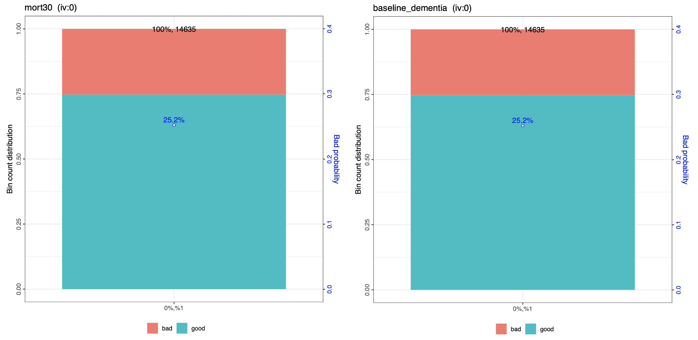
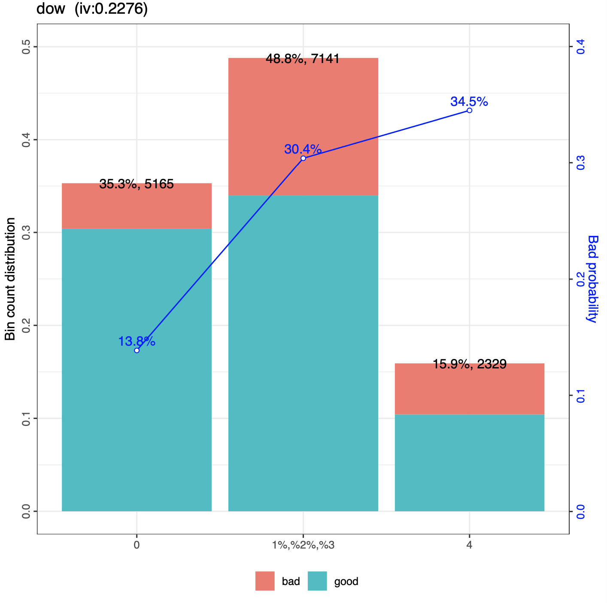
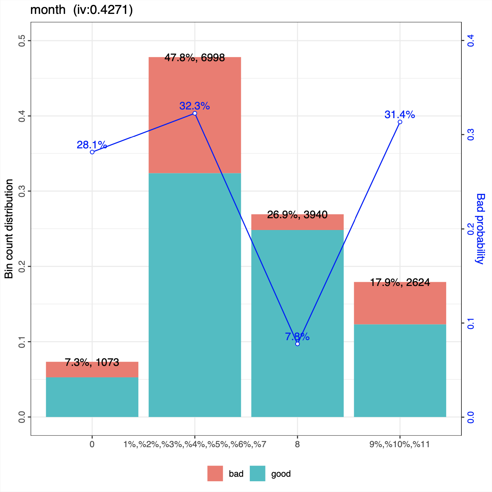

```{r setup, include=FALSE}
knitr::opts_chunk$set(echo = TRUE)
```

```
                                         [IIIII]
                                          )"""(
                                         /     \
                                        /       \
                                        |`-...-'|
                                        |aspirin|
                                      _ |`-...-'j    _
                                     (\)`-.___.(I) _(/)
                                       (I)  (/)(I)(\)
                                          (I)        
```

# 1. Introducción y descripción de los datos

El objetivo del presente proyecto consiste en __elaborar un modelo de clasificación binaria que permita predecir si un  paciente presentará o será más propenso a padecer una complicación hospitalaria tras una intervención quirúrgica [^1]__. Originalmente, el fichero original (extraído de la plataforma Kaggle) contiene tres variables objetivo, dos continuas:

1. _ccsComplicationRate_: incidencia general de complicaciones hospitalarias por cada tipo de intervención quirúrgica.
2. _complication_rsi_: índice de estratificación de riesgo en complicaciones hospitalarias.

Y una binaria:

3. _complication_: __si el paciente ha sufrido una complicación (1) o no (0)__.

Por tanto, de cara a la práctica tendremos únicamente en cuenta, como variable objetivo, la columna _complication_, descartando las dos variables continuas anteriores.

En relación con las posibles variables _input_, nos encontramos con las siguientes:

__CONTINUAS__

1. _bmi_: __índice de masa de corporal__.

2. _Age_: __edad del paciente__.

3. _baseline_charlson_: __índice de comodidad de Charlson, el cual predice la mortalidad a diez años de un paciente que puede tener una variedad de condiciones comórbidas (como una enfermedad cardíaca, SIDA o cáncer)__.

4. _ahrq_ccs_: __tipo de procedimiento/intervención quirúrgica, etiquetado por la Agencia estadounidense para la Investigación Sanitaria [^2]__. Dicha variable contiene un total de 22 valores únicos, por lo que se ha decidido mantener la variable como numérica.

5. _ccsMort30Rate_: __incidencia general de mortalidad a los 30 días por cada intervención (dado por el código de la columna ahrq_ccs)__.

6. _hour_: __hora a la que se realizó la intervención__.

7. _mortality_rsi_: __índice de estratificación de riesgo en la mortalidad a los 30 días__.

__CATEGÓRICAS__

8. _asa_status_: __estado físico del paciente establecido por la Sociedad Americana de Anestesiología [^3]__. Contiene tres categorías:
  * 0: __estado I-II__ (paciente sano / paciente con enfermedad sistémica leve).
  * 1: __estado III__ (paciente con enfermedad sistémica grave).
  * 2: __estado IV-VI__ (paciente con enfermedad muy grave / no espera sobrevivir sin la operación / muerte cerebral).
  
9. _baseline_cancer_: __¿El paciente padece algún cáncer?__ (1 = Sí; 0 = No)

10. _baseline_cvd_: __¿El paciente sufre alguna enfermedad cardio o cerebrovascular?__ (1 = Sí; 0 = No)

11. _baseline_dementia_: __¿El paciente sufre algún trastorno por demencia?__ (1 = Sí; 0 = No)

12. _baseline_diabetes_: __¿El paciente sufre diabetes?__ (1 = Sí; 0 = No)

13. _baseline_digestive_: __¿El paciente sufre alguna enfermedad gastro-intestinal?__ (1 = Sí; 0 = No)

14. _baseline_osteoart_: __¿El paciente padece osteoartritis[^4]?__ (1 = Sí; 0 = No)

15. _baseline_psych_: __¿El paciente padece algún desorden psiquiátrico?__ (1 = Sí; 0 = No)

16. _baseline_pulmonar_: __¿El paciente sufre alguna enfermedad pulmonar?__ (1 = Sí; 0 = No)

17. _dow_ o _day of week_: __día de la semana en el que se realizó la intervención__ (0 = Lunes; 1 = Martes; 2 = Miércoles; 3 = Jueves; 4 = Viernes).

18. _month_: __mes en el que se realizó la intervención__.

19. _moonphase_: __fase lunar que tuvo lugar durante la intervención quirúrgica__ (0 = Luna nueva; 1 = Cuarto creciente; 2 = Luna llena; 3 = Cuarto menguante).

20. _mort30_: __¿El paciente presenta algún riesgo de fallecer a los 30 días?__ (1 = Sí; 0 = No)

21. _race_: __raza del paciente__ (0 = Caucásico; 1 = Afroameriano; 2 = Otro)

[^1]: https://www.kaggle.com/omnamahshivai/surgical-dataset-binary-classification
[^2]: https://www.hcup-us.ahrq.gov/toolssoftware/ccs10/CCSCategoryNames(FullLabels).pdf
[^3]: https://www.asahq.org/standards-and-guidelines/asa-physical-status-classification-system
[^4]: https://dicciomed.usal.es/palabra/osteoartritis

# 2. Librerías empleadas

A continuación, se expone un listado de las librerías empleadas en el desarrollo del proyecto:

1. _caret_: tuneo de hipérparámetros de los diferentes algoritmos de clasificación.

2. _data.table_: estructura de datos, similar al _data.frame_, aunque mucho más eficiente en memoria.

3. _ggplot2_: librería gráfica.

4. _scorecard_: cálculo del valor de información (IV), así como el peso de la evidencia (WOE).

5. _dummies_: transformación de variables categóricas a _dummies_.

6. _forcats_: tratamiento de variables categóricas.

7. _inspectdf_: libreria para inspeccionar las caracteristicas principales de un _dataset_, incluyendo variables categóricas, valores _missing_ o distribución de las variables continuas.

8. _dplyr_: manipulación de datos.

9. _psych_: información general de data.frames y/o data.tables (media, asimetría, desviación típica, entre otros).

10. _doParallel_ y _parallel_: paralelización de funciones.

11. _readxl_: lectura de ficheros _Excel_ (.xlsx).

12. _visualpred_: visualización de predicciones por diferentes algoritmos de clasificación.

13. _h2o_: _auto Machine Learning (autoML)_.

14. __Librerías y funciones proporcionadas por el profesor__.

```{r}
#--- Librerias
suppressPackageStartupMessages({
  library(caret)         # Data partitioning
  library(data.table)    # Lectura de ficheros mucho mas rapido que read.csv
  library(dplyr)         # Manipulacion de datos
  library(ggplotgui)     # EDA manual mediante entorno interactivo (GUI)
  library(ggplot2)       # Libreria grafica
  library(scorecard)     # Woebin + Woebin_plot + Information Value (IV)
  library(bestNormalize) # Transformacion optima variables continuas
  library(VGAM)          # Aplicacion de transformaciones sobre variables
  library(dummies)       # Creacion variables dummy
  library(psych)         # Informacion estadistica de dataframes
  library(ranger)        # Random Forest (+ rapido que caret)
  library(forcats)       # Tratamiento variables categoricas
  library(inspectdf)     # EDA Automatico (II)
  library(purrr)         # Programacion Funcional
  
  source("./librerias/librerias_propias.R")
})
```

# 3. Depuración de los datos

Inicialmente, comenzamos con la lectura del fichero:

```{r}
# Lectura del fichero
surgical_dataset <- fread("./data/Surgical-deepnet.csv", data.table = FALSE)
dim(surgical_dataset) # Filas x columnas
```

Nos encontramos con 14.635 observaciones, junto con las 25 variables descritas anteriormente. En primer lugar, __codificamos como _factor_ tanto la variable objetivo como el resto de variables categóricas__:

```{r}
# Codificamos como factor la variable objetivo...
surgical_dataset$complication <- as.factor(surgical_dataset$complication)
# ...Asi como el resto de variables categoricas mencionadas anteriormente
cat_columns <- c("gender", "race", "asa_status", "baseline_cancer", "baseline_cvd", "baseline_dementia",
                 "baseline_diabetes", "baseline_digestive", "baseline_osteoart", "baseline_psych",
                 "baseline_pulmonary", "dow", "month", "moonphase", "mort30")
surgical_dataset[,cat_columns] <- lapply(surgical_dataset[, cat_columns], factor)
```

A continuación, almacenamos los nombres de cada variable en un vector por separado, __en función de si es continua o categórica__:

```{r}
# Separamos las variables en numericas, categoricas y target
# [-16] => Salvo la variable objetivo
cat_columns <- names(Filter(is.factor, surgical_dataset))[-16]
num_columns <- names(Filter(is.numeric, surgical_dataset))
target      <- "complication"
```

## 3.1 Valores NA

Como se puede comprobar a continuación, el _dataset_ __no contiene valores _missing_ en ninguna de las variables:

```{r}
sum(is.na(surgical_dataset))
```

## 3.2 Variables categóricas

Tras almacenar los nombres de cada variable, mediante la librería _inspectdf_ se realizó un primer análisis exploratorio de datos automático con el que __analizar el dataset en primera instancia__. Dado que el contenido que el informe es muy extenso, se incluirá en la memoria el contenido esencial (el informe completo se incluye en el anexo _00_EDA_report_with_factors.pdf_ ).

Sobre dicho informe comenzamos remarcando la frecuencia de aparición de los niveles de cada variable categórica:

```{r}
x <- inspectdf::inspect_cat(surgical_dataset[, cat_columns], include_int = TRUE)
show_plot(x)
```

A simple vista, prácticamente todas las categorías presentan una frecuencia de aparición superior a las 100 observaciones, __salvo por _baseline_dementia_ y _mort30___, donde el número de observaciones a 1 es de 71 y 58, respectivamente.

```{r}
surgical_dataset[, c("baseline_dementia", "mort30")] %>% map(table)
```

Es decir, se tratan de variables con pocas observaciones con valor 1. De hecho, si analizamos el valor de información, haciendo uso del paquete _scorecard_:

```{r, echo=FALSE, out.width="99%", out.height="99%", fig.align="center", fig.cap="Mort 30 y Baseline dementia (IV)"}

```

Observamos que el valor de información es cero, dada la poca representatividad de los valores a 1, de forma que el paquete _scorecard_ acaba uniendo ambas categorías, lo que se traduce en un escaso poder predictivo. Por otro lado, si analizamos la proporción de aparición de la variable objetivo sobre cada categoría:

```{r}
#-- baseline_dementia
surgical_dataset %>%
    count(baseline_dementia, complication) %>%
    group_by(complication)

#-- mort30
surgical_dataset %>%
    count(mort30, complication) %>%
    group_by(complication)
```

A simple vista, en ambas variables __no existe una clara diferencia entre ambas categorías__. Por tanto, se ha tomado la decisión de descartar ambas columnas del conjunto de datos.

```{r}
surgical_dataset$baseline_dementia <- NULL; surgical_dataset$mort30 <- NULL 
```

### 3.2.1 Agrupación de variables categóricas

Por otro lado, nos encontramos con dos variables cuyas categorías pueden ser agrupadas, según la información proporcionada por el paquete _scorecard_:

__DÍA DE LA SEMANA__ (dow): 

```{r, echo=FALSE, out.width="65%", out.height="65%", fig.align="center", fig.cap="Dia de la semana o dow (IV)"}

```

Sobre dicha variable, __observamos una relación "lineal" en la distribución de la variable objetivo a lo largo de los diferentes días de la semana__, comenzando por el Lunes (0), con el menor porcentaje de complicaciones hospitalarias (alrededor del 14 %), seguido de los Martes-Miércoles-Jueves, donde el porcentaje aumenta hasta el 30.4 %, y finalizando con los viernes, donde se alcanza el mayor porcentaje de complicaciones hospitalarias sobre el total: 34.5 %.

Por otro lado, si analizamos detenidamente el gráfico de distribución:

```{r, echo=FALSE}
ggplot(surgical_dataset, aes(x = dow, fill = factor(complication))) +
  geom_bar() +
  labs(x = 'Day of week', y = 'Nº patients') +
  ggtitle('Complication distribution by day of week') +
  theme_minimal() +
  theme(
    text = element_text(family = 'Helvetica')
  ) + geom_text(stat='count', aes(label=..count..), position = position_stack(vjust = 0.5))
```

Observamos que la proporción de aparición de pacientes con complicaciones es muy similar entre los martes, miércoles y jueves:

```{r, echo=FALSE}
knitr::kable(data.frame(dow = c("1","2","3", "En conjunto (1-2-3)", "4"), 
                        sin.comp = c(4450, 1810, 1347, 1813, 1525),
                        con.comp = c(715, 786, 682, 703, 804),
                        total = c(2596, 2029, 2516, 7141, 2329),
                        prop.complicacion = c(
  round((786/(786+1810)), 3) * 100,
  round((682/(682+1347)), 3) * 100,
  round((703/(1813+703)), 3) * 100,
  round((2171/(2171+4970)), 3) * 100,
  round((804/(1525+804)), 3) * 100
)))
```

En conjunto, acumulan alrededor del 30.4 % de pacientes con complicaciones, mientras que con tan solo el viernes aumenta hasta alcanzar el 34 %. Por tanto, dado que los martes, miércoles y jueves presentan una proporción de aparición similar, __las agrupamos en torno a una misma categoría__:

1. __Lunes (0)__
2. __Martes-Miercoles-Jueves (1-3)__
3. __Viernes (4)__

__MES__ (month):

```{r, echo=FALSE, out.width="75%", out.height="75%", fig.align="center", fig.cap="Month (IV)"}

```

En este caso, llaman la atención tres principales grupos: en primer lugar el mes de enero (0), con un 28.1 % de las complicaciones hospitalarias, __seguido de los meses de febrero (1) hasta agosto (7) con un total acumulado del 32.3 % de los pacientes con complicaciones__, es decir, el mes de enero tiene un porcentaje similar de pacientes con complicaciones que los siguientes 7 meses en conjunto. Por el contrario, __durante el mes de septiembre (8) el porcentaje se desploma hasta el 7.8 %__, porcentaje que vuelve a aumentar en los tres meses siguientes (octubre, noviembre y diciembre), hasta el 31.4 %.

Por otro lado, si analizamos el gráfico de distribución:

```{r, echo=FALSE}
ggplot(surgical_dataset, aes(x = month, fill = factor(complication))) +
  geom_bar() +
  labs(x = 'Month', y = 'Nº patients') +
  ggtitle('Complication distribution by month') +
  theme_minimal() +
  theme(
    text = element_text(family = 'Helvetica')
  ) + geom_text(stat='count', aes(label=..count..), position = position_stack(vjust = 0.5), size = 2.2)
```

Sucede un comportamiento similar al de la variable _dow_: salvo el mes de septiembre, __la distribución de la variable objetivo sobre cada mes es muy similar, de forma que podemos agrupar varios de los meses en una misma categoría, tal y como hemos comprobado anteriormente__. A modo de ejemplo, analicemos la proporción en el número de complicaciones hospitalarias de cada mes por separado y en conjunto:


1. __Enero (0)__
2. __Febrero a Agosto (1-7)__
3. __Septiembre (8)__
4. __Octubre, Noviembre y Diciembre (9-10-11)__

En relación con el resto de variables categóricas, si analizamos el valor de información de obtenido:


