```{r setup, include=FALSE}
knitr::opts_chunk$set(fig.pos = "h!", out.extra = '')
knitr::opts_chunk$set(echo = TRUE)
```

```
                                         [IIIII]
                                          )"""(
                                         /     \
                                        /       \
                                        |`-...-'|
                                        |aspirin|
                                      _ |`-...-'|    _
                                     (\)`-.___.(I) _(/)
                                       (I)  (/)(I)(\)
                                          (I)        
```
__Nota__: a lo largo de la práctica, tanto en el tuneo de hiperparámetros como en la comparación de modelos se ha llevado a cabo mediante __validación cruzada repetida__, con la misma semilla (1234) y nº de grupos (5).

\newpage
# 1. Introducción y descripción de los datos

El objetivo del presente proyecto consiste en __elaborar un modelo de clasificación binaria que permita predecir si un  paciente presentará o será más propenso a padecer una complicación hospitalaria tras una intervención quirúrgica [^1]__. Originalmente, el fichero (extraído de la plataforma Kaggle) contiene tres variables objetivo, dos continuas:

1. _ccsComplicationRate_: incidencia general de complicaciones hospitalarias por cada tipo de intervención quirúrgica.
2. _complication_rsi_: índice de estratificación de riesgo en complicaciones hospitalarias.

Y una binaria:

3. _complication_: __si el paciente ha sufrido una complicación (1) o no (0)__.

Por tanto, de cara a la práctica tendremos únicamente en cuenta, como variable objetivo, la columna _complication_, descartando las dos variables continuas anteriores.

En relación con las posibles variables _input_, nos encontramos con las siguientes:

__CONTINUAS__

1. _bmi_: __índice de masa corporal__.

2. _Age_: __edad del paciente__.

3. _baseline_charlson_: __índice de comorbidad de Charlson, el cual predice la mortalidad a diez años de un paciente que puede tener una variedad de condiciones comórbidas (como una enfermedad cardíaca, SIDA o cáncer)__.

4. _ahrq_ccs_: __tipo de procedimiento/intervención quirúrgica, etiquetado por la Agencia estadounidense para la Investigación Sanitaria [^2]__. Dicha variable contiene un total de 22 valores únicos, por lo que se ha decidido mantener la variable como numérica.

5. _ccsMort30Rate_: __incidencia general de mortalidad a los 30 días por cada intervención (dado por el código de la columna ahrq_ccs)__.

6. _hour_: __hora a la que se realizó la intervención__.

7. _mortality_rsi_: __índice de estratificación de riesgo en la mortalidad a los 30 días__.

__CATEGÓRICAS__

8. _asa_status_: __estado físico del paciente establecido por la Sociedad Americana de Anestesiología [^3]__. Contiene tres categorías:
  * 0: __estado I-II__ (paciente sano / paciente con enfermedad sistémica leve).
  * 1: __estado III__ (paciente con enfermedad sistémica grave).
  * 2: __estado IV-VI__ (paciente con enfermedad muy grave / no espera sobrevivir sin la operación / muerte cerebral).
  
9. _baseline_cancer_: __¿El paciente padece algún cáncer?__ (1 = Sí; 0 = No)

10. _baseline_cvd_: __¿El paciente sufre alguna enfermedad cardio o cerebrovascular?__ (1 = Sí; 0 = No)

11. _baseline_dementia_: __¿El paciente sufre algún trastorno por demencia?__ (1 = Sí; 0 = No)

12. _baseline_diabetes_: __¿El paciente sufre diabetes?__ (1 = Sí; 0 = No)

13. _baseline_digestive_: __¿El paciente sufre alguna enfermedad gastro-intestinal?__ (1 = Sí; 0 = No)

14. _baseline_osteoart_: __¿El paciente padece osteoartritis[^4]?__ (1 = Sí; 0 = No)

15. _baseline_psych_: __¿El paciente padece algún desorden psiquiátrico?__ (1 = Sí; 0 = No)

16. _baseline_pulmonar_: __¿El paciente sufre alguna enfermedad pulmonar?__ (1 = Sí; 0 = No)

17. _dow_ o _day of week_: __día de la semana en el que se realizó la intervención__ (0 = Lunes; 1 = Martes; 2 = Miércoles; 3 = Jueves; 4 = Viernes).

18. _month_: __mes en el que se realizó la intervención__.

19. _moonphase_: __fase lunar que tuvo lugar durante la intervención quirúrgica__ (0 = Luna nueva; 1 = Cuarto creciente; 2 = Luna llena; 3 = Cuarto menguante).

20. _mort30_: __¿El paciente presenta algún riesgo de fallecer a los 30 días?__ (1 = Sí; 0 = No)

21. _gender_: __Sexo del paciente__ (0 = Hombre; 1 = Mujer)

22. _race_: __raza del paciente__ (0 = Caucásico; 1 = Afroameriano; 2 = Otro)

[^1]: https://www.kaggle.com/omnamahshivai/surgical-dataset-binary-classification
[^2]: https://www.hcup-us.ahrq.gov/toolssoftware/ccs10/CCSCategoryNames(FullLabels).pdf
[^3]: https://www.asahq.org/standards-and-guidelines/asa-physical-status-classification-system
[^4]: https://dicciomed.usal.es/palabra/osteoartritis

# 2. Librerías empleadas

A continuación, se expone un listado de las librerías empleadas en el desarrollo del proyecto:

1. _caret_: tuneo de hipérparámetros de los diferentes algoritmos de clasificación.

2. _data.table_: estructura de datos, similar al _data.frame_, aunque mucho más eficiente en memoria.

3. _ggplot2_: librería gráfica.

4. _scorecard_: cálculo del valor de información (IV), así como el peso de la evidencia (WOE).

5. _dummies_: transformación de variables categóricas a _dummies_.

6. _forcats_: tratamiento de variables categóricas.

7. _inspectdf_: libreria para inspeccionar las caracteristicas principales de un _dataset_, incluyendo variables categóricas, valores _missing_ o distribución de las variables continuas.

8. _dplyr_: manipulación de datos.

9. _psych_: información general de data.frames y/o data.tables (media, asimetría, desviación típica, entre otros).

10. _doParallel_ y _parallel_: paralelización de funciones.

11. _readxl_: lectura de ficheros _Excel_ (.xlsx).

12. _purrr_: herramientas de programación funcional.

13. _visualpred_: visualización de predicciones por diferentes algoritmos de clasificación.

14. _h2o_: _auto Machine Learning (autoML)_.

15. __Librerías y funciones proporcionadas por el profesor__.

```{r, echo=FALSE}
#--- Librerias
suppressPackageStartupMessages({
  library(caret)         # Data partitioning
  library(data.table)    # Lectura de ficheros mucho mas rapido que read.csv
  library(dplyr)         # Manipulacion de datos
  library(ggplot2)       # Libreria grafica
  library(scorecard)     # Woebin + Woebin_plot + Information Value (IV)
  library(dummies)       # Creacion variables dummy
  library(psych)         # Informacion estadistica de dataframes
  library(ranger)        # Random Forest (+ rapido que caret)
  library(forcats)       # Tratamiento variables categoricas
  library(inspectdf)     # EDA Automatico (II)
  library(purrr)         # Programacion Funcional
  
  source("./librerias/librerias_propias.R")
})
```

# 3. Depuración de los datos

Inicialmente, comenzamos con la lectura del fichero:

```{r}
# Lectura del fichero
surgical_dataset <- fread("./data/Surgical-deepnet.csv", data.table = FALSE)

# Eliminamos las dos variables objetivo continuas
surgical_dataset$ccsComplicationRate <- NULL; surgical_dataset$complication_rsi <- NULL

dim(surgical_dataset) # Filas x columnas
```

Nos encontramos con 14.635 observaciones, junto con las 23 variables descritas anteriormente. Si echamos un vistazo a la variable objetivo, podemos observar el desbalanceo entre ambas categorías:

```{r}
table(surgical_dataset$complication)
```

## 3.1 Codificación a _factor_

Tras la lectura del fichero, __codificamos como _factor_ tanto la variable objetivo como el resto de variables categóricas__:

```{r}
# Codificamos como factor la variable objetivo...
surgical_dataset$complication <- as.factor(surgical_dataset$complication)
# ...Asi como el resto de variables categoricas mencionadas anteriormente
cat_columns <- c("gender", "race", "asa_status", "baseline_cancer", "baseline_cvd", 
                 "baseline_dementia", "baseline_diabetes", "baseline_digestive", 
                 "baseline_osteoart", "baseline_psych", "baseline_pulmonary", 
                 "dow", "month", "moonphase", "mort30")
surgical_dataset[,cat_columns] <- lapply(surgical_dataset[, cat_columns], factor)
```

A continuación, almacenamos los nombres de cada variable en un vector por separado, __en función de si es continua o categórica__:

```{r}
# Separamos las variables en numericas, categoricas y target
# [-16] => Salvo la variable objetivo
cat_columns <- names(Filter(is.factor, surgical_dataset))[-16]
num_columns <- names(Filter(is.numeric, surgical_dataset))
target      <- "complication"
```

## 3.2 Valores NA

Como se puede comprobar a continuación, el _dataset_ __no contiene valores _missing_ en ninguna de las variables__:

```{r}
sum(is.na(surgical_dataset))
```

## 3.3 Variables categóricas

Tras almacenar los nombres de cada variable, mediante la librería _inspectdf_ se realizó un primer análisis exploratorio de datos automático con el que __analizar el dataset en primera instancia__. Dado que el contenido del informe es muy extenso, se incluirá en la memoria el contenido esencial (el informe completo se incluye, desglosado, en los anexos _00_EDA_report.pdf_ y _WOEBIN_factor_variables.pdf_ ).

Sobre dicho informe, __comenzamos remarcando la frecuencia de aparición de los niveles de cada variable categórica__:

```{r, fig.width=7, fig.height=3.3}
x <- inspectdf::inspect_cat(surgical_dataset[, cat_columns], include_int = TRUE)
show_plot(x)
```

A simple vista, prácticamente todas las categorías presentan una alta frecuencia de aparición, __salvo por _baseline_dementia_ y _mort30___, donde el número de observaciones a 1 es de 71 y 58, respectivamente.

```{r, eval=FALSE}
surgical_dataset[, c("baseline_dementia", "mort30")] %>% map(table)
```

```
## $baseline_dementia     $mort30
##
##     0     1                0       1
## 14564    71            14577      58
```

Es decir, se tratan de variables con pocas observaciones con valor 1. De hecho, si analizamos el valor de información haciendo uso del paquete _scorecard_, la cual nos permite estudiar el "poder predictivo de una variable", observamos que el valor de información es cero, __dada la poca representatividad de los valores a 1__, de forma que el paquete _scorecard_ acaba uniendo ambas categorías, lo que se traduce en un escaso poder de predicción:

```{r, echo=FALSE, out.width="99%", out.height="99%", fig.align="center", fig.cap="Mort 30 y Baseline dementia (IV)"}
knitr::include_graphics("./capturas/Depuracion/woebin_mort30_dementia.png")
```

Por otro lado, si analizamos la proporción de aparición de la variable objetivo sobre cada categoría:

```{r}
#-- baseline_dementia
surgical_dataset %>%
    count(baseline_dementia, complication) %>%
    group_by(complication)

#-- mort30
surgical_dataset %>%
    count(mort30, complication) %>%
    group_by(complication)
```

A simple vista, en ambas variables __no existe una clara separación sobre la variable objetivo__. Por tanto, se ha tomado la decisión de descartar ambas columnas del conjunto de datos.

```{r}
surgical_dataset$baseline_dementia <- NULL; surgical_dataset$mort30 <- NULL 

# Actualizamos el vector con las variables categoricas
cat_columns <- setdiff(cat_columns, c("baseline_dementia", "mort30"))
```

### 3.3.1 Agrupación de variables categóricas

Por otro lado, nos encontramos con dos variables cuyas categorías pueden ser agrupadas, según la información proporcionada por el paquete _scorecard_:

__DÍA DE LA SEMANA__ (dow): 

Sobre dicha variable, __observamos una relación "lineal" en la distribución de la variable objetivo a lo largo de los diferentes días de la semana__, comenzando por el Lunes (0), con el menor porcentaje de complicaciones hospitalarias (alrededor del 14 %), seguido de los Martes-Miércoles-Jueves, donde el porcentaje aumenta hasta el 30.4 %, y finalizando con los viernes, donde se alcanza el mayor porcentaje de complicaciones hospitalarias: 34.5 %:

```{r, echo=FALSE, out.width="65%", out.height="65%", fig.align="center", fig.cap="Dia de la semana o dow (IV)"}
knitr::include_graphics("./capturas/Depuracion/dow.png")
```

Por otro lado, si analizamos detenidamente el gráfico de distribución:

```{r, echo=FALSE, fig.width=7, fig.height=4}
ggplot(surgical_dataset, aes(x = dow, fill = factor(complication))) +
  geom_bar() +
  labs(x = 'Day of week', y = 'Nº patients') +
  ggtitle('Complication distribution by day of week') +
  theme_minimal() +
  theme(
    text = element_text(family = 'Helvetica')
  ) + geom_text(stat='count', aes(label=..count..), position = position_stack(vjust = 0.5), size = 2.5) + 
  theme(legend.position="bottom")
```

Observamos que la proporción de aparición de pacientes con complicaciones es muy similar entre los martes, miércoles y jueves:

```{r, echo=FALSE}
data.frame(dow = c("1","2","3", "En conjunto (1-2-3)", "4"), 
                        sin.comp = c(4450, 1810, 1347, 1813, 1525),
                        con.comp = c(715, 786, 682, 703, 804),
                        total = c(2596, 2029, 2516, 7141, 2329),
                        prop.complicacion = c(
  round((786/(786+1810)), 3) * 100,
  round((682/(682+1347)), 3) * 100,
  round((703/(1813+703)), 3) * 100,
  round((2171/(2171+4970)), 3) * 100,
  round((804/(1525+804)), 3) * 100
))
```

En conjunto, acumulan alrededor del 30.4 % de pacientes con complicaciones, mientras que con tan solo el viernes aumenta hasta alcanzar el 34 %. Por tanto, dado que los martes, miércoles y jueves presentan una proporción de aparición similar, __las agrupamos en torno a una misma categoría__:

1. __Lunes (0)__
2. __Martes-Miercoles-Jueves (1-3)__
3. __Viernes (4)__

__MES__ (month):

```{r, echo=FALSE, out.width="75%", out.height="75%", fig.align="center", fig.cap="Month (IV)"}
knitr::include_graphics("./capturas/Depuracion/month.png")
```

En este caso, llaman la atención tres principales grupos: en primer lugar el mes de enero (0), con un 28.1 % de las complicaciones hospitalarias, __seguido de los meses de febrero (1) hasta agosto (7) con un total acumulado del 32.3 % de los pacientes con complicaciones__, es decir, el mes de enero tiene un porcentaje similar de pacientes con complicaciones que los siguientes 7 meses en conjunto. Por el contrario, __durante el mes de septiembre (8) el porcentaje se desploma hasta el 7.8 %__, porcentaje que vuelve a aumentar en los tres meses siguientes (octubre, noviembre y diciembre), hasta el 31.4 %.

Por otro lado, si analizamos el gráfico de distribución:

```{r, echo=FALSE}
ggplot(surgical_dataset, aes(x = month, fill = factor(complication))) +
  geom_bar() +
  labs(x = 'Month', y = 'Nº patients') +
  ggtitle('Complication distribution by month') +
  theme_minimal() +
  theme(
    text = element_text(family = 'Helvetica')
  ) + geom_text(stat='count', aes(label=..count..), position = position_stack(vjust = 0.5), size = 2.2)  + 
  theme(legend.position="bottom")
```

Sucede un comportamiento similar al de la variable _dow_: salvo el mes de septiembre, __la distribución de la variable objetivo sobre cada mes es muy similar, de forma que podemos agrupar varios de los meses en una misma categoría, tal y como hemos comprobado anteriormente__. A modo de ejemplo, analicemos la proporción en el número de complicaciones hospitalarias de cada mes por separado y en conjunto:

```{r, echo=FALSE}
data.frame(dow = c("0","1","2", "3", "4", "5", "6", "7", "Uniendo 1-7", "8", "9", "10", "11", "Uniendo 9-11"), 
                        sin.comp = c(771, 742, 461 ,670, 699, 618, 810, 739, 4739, 3634, 586, 541, 674, 1801),
                        con.comp = c(302, 385, 220,319, 382, 271, 381, 301, 2259, 306, 246, 258, 319, 823),
                        total = c(1073, 1127, 681, 989, 1081, 889, 1191, 1040, 6998, 3940, 832, 799, 993, 2624),
                        prop.complicacion = c(
  round((302/(771+302)), 3) * 100,
  round((385/(742+385)), 3) * 100,
  round((220/(220+461)), 3) * 100,
  round((319/(670+319)), 3) * 100,
  round((382/(699+382)), 3) * 100,
  round((271/(618+271)), 3) * 100,
  round((381/(381+810)), 3) * 100,
  round((301/(739+301)), 3) * 100,
  round((2259/(4739+2259)), 3) * 100,
  round((306/(3634+306)), 3) * 100,
  round((246/(586+246)), 3) * 100,
  round((258/(541+258)), 3) * 100,
  round((319/(674+319)), 3) * 100,
  round((823/(1801+823)), 3) * 100
  
))
```

Como podemos comprobar, __la proporción de pacientes con complicaciones hospitalarias, entre los meses de febrero (1) y agosto (7), se sitúa en torno al 32 % si agrupamos dichas categorías__. Del mismo modo, __los meses de octubre, noviembre y diciembre (9, 10 y 11) se sitúan en torno al 31 %__. Como consecuencia, y dado que dichas categorías presentan una proporción similar en cuanto a pacientes con complicaciones se refiere, las agrupamos:

1. __Enero (0)__
2. __Febrero a Agosto (1-7)__
3. __Septiembre (8)__
4. __Octubre, Noviembre y Diciembre (9-10-11)__

En relación con el resto de variables categóricas, si analizamos su valor de información:

```{r, echo=FALSE}
data.frame(variable = c("baseline_osteoart", "month", "dow", "moonphase", 
                                     "baseline_cancer", "baseline_cvd", "gender", "baseline_digestive", "asa_status",
                                      "baseline_pulmonary", "baseline_diabetes", "race", "baseline_psych"), iv = c(0.5246, 0.4271, 0.2276, 0.2119, 0.1358, 0.0429, 0.0221, 0.0134, 0.0062, 0.0053, 0.0013, 2e-04, 1e-04))
```

Por lo general, la mayoría de las variables categóricas presentan, como primera impresión, un buen poder predicitivo, con ciertas excepciones como _asa_status_, _baseline_pulmonary_, _baseline_diabetes_, _race_ o _baseline_pysch_, cuyo IV no alcanza el 0.01 (como normal general, un valor de información inferior a 0.1-0.02 se traduce en un poder predictivo muy bajo o prácticamente nulo)[^5]. De este modo, de cara a la selección de variables, __en caso de ser necesario descartar alguna variable categórica, utilizaremos esta tabla como referencia__.

[^5]:https://docs.tibco.com/pub/sfire-dsc/6.5.0/doc/html/TIB_sfire-dsc_user-guide/GUID-07A78308-525A-406F-8221-9281F4E9D7CF.html

```{r, echo=FALSE}
surgical_dataset<- surgical_dataset %>% mutate(dow = recode(
                                          dow, 
                                          `1` = "1-3",
                                          `2` = "1-3",
                                          `3` = "1-3"
                    ))

surgical_dataset <- surgical_dataset %>% mutate(month = recode(
                                  month, 
                                  `1` = "1-7", `2` = "1-7", `3` = "1-7", `4` = "1-7", `5` = "1-7",
                                  `6` = "1-7", `7` = "1-7", `9` = "9-11", `10` = "9-11", `11` = "9-11"
                    ))
```

## 3.4 Variables continuas

En relación con las variables continuas, nos encontramos con algunas variables con un número de valores únicos muy reducidos:

```{r}
#-- Nº Valores unicos (continuas)
apply(surgical_dataset[, num_columns], 2, function(x) {length(unique(x))})
```

A modo de ejemplo, variables como _baseline_charlson_, _ahrq_ccs_ o _ccsMort30Rate_ presentan 14, 22 o 20 valores únicos, respectivamente. No obstante, se tomó la decisión de mantener dichas variables como continuas, principalmente para facilitar la selección de variables, evitando con ello crear nuevas variables _dummy_ (una por cada categoría), utilizando con ello menos parámetros para describir el conjunto de datos.

Por otro lado, en un primer análisis exploratorio se observó que en las variables continuas, por lo general, __no existe una clara separación entre ambas variables objetivo__. A modo de ejemplo, observemos las dos siguientes variables: _age_ y _bmi_:

__AGE__:

```{r, echo=FALSE, fig.width=7, fig.height=4}
barras <- ggplot(surgical_dataset, aes(x = Age, fill = factor(complication))) + 
                  geom_boxplot() + 
                  theme_minimal() + ggtitle("Age boxplot by target") + theme(legend.position = "bottom")

barras
```

En este caso, __bien es cierto que los pacientes que no sufren complicaciones oscilan entre los 25 y los 90 años, aproximadamente, mientras que existe un número de pacientes (menores a 25 años), donde padecen alguna complicación hospitalaria__. Pese a ello, la separación no es tan clara.

__BMI__:

```{r, echo=FALSE, fig.width=7, fig.height=4}
barras <- ggplot(surgical_dataset, aes(x = bmi, fill = factor(complication))) + 
                  geom_boxplot() + 
                  theme_minimal() + ggtitle("bmi boxplot by target") + theme(legend.position = "bottom")

barras
```

Incluso con el índice de masa de corporal, __a simple vista no existe una clara separación que diferencie a ambas variables objetivo en función de dicho índice__.

## 3.5 Estandarización de variables continuas

Una vez realizado el primer análisis, __procedemos a la estandarización de las variables continuas__:

```{r}
# --- Estandarizacion de variables
surgical_dataset_stnd <- surgical_dataset

# media
media       <- sapply(surgical_dataset_stnd[, num_columns], mean)

# sd
desv.tipica <- sapply(surgical_dataset_stnd[, num_columns], sd)

surgical_dataset_stnd[, num_columns] <- scale(surgical_dataset_stnd[, num_columns], 
                                              center = media, 
                                              scale = desv.tipica)
```

## 3.6 Creacion de variables dummy

A continuación, convertimos las variables categóricas (con más de una categoría) en variables _dummy_, mediante la función _dummy.data.frame_, conviritiendo de este modo todas las variables a formato numérico:

```{r, warning=FALSE}
columnas_dummy <- c("asa_status", "dow", "month", "moonphase", "race")
surgical_dataset_stnd_dummy <- dummy.data.frame(surgical_dataset_stnd[, columnas_dummy], 
                                                            sep = ".")
```

Una vez codificadas las variables, __comprobamos si existen variables _dummy_ con una frecuencia de aparición menor a 100__:

```{r}
names(surgical_dataset_stnd_dummy[, colSums(surgical_dataset_stnd_dummy == 0) < 100, 
                                  drop = FALSE])

```

Como podemos comprobar, todas las variables _dummy_ codificadas presentan una frecuencia superior. A continuación, __unimos en un único _data.table_ tanto las variables numéricas, las variables categóricas (binarias), las variables _dummy_, así como la variable objetivo__:

```{r}
surgical_dataset_final <- cbind(
                                surgical_dataset_stnd[, num_columns],
                                surgical_dataset_stnd[, cat_columns[!cat_columns %in% columnas_dummy]],
                                surgical_dataset_stnd_dummy,
                                surgical_dataset_stnd[, target]
                              )
```

Finalmente, de cara a la elaboración de los modelos __codificamos la variable objetivo como "Yes" / "No"__, renombrando la variable como _target_:

```{r}
#-- Renombramos la variable objetivo como "target"
names(surgical_dataset_final)[33] <- "target"

# Renombramos las columnas para adecuarlas a formulas
names(surgical_dataset_final) <- make.names(names(surgical_dataset_final))

# 1 - "Yes" ; 0 - "No"
surgical_dataset_final$target <- ifelse(
  surgical_dataset_final$target == 1,
  "Yes",
  "No"
)

surgical_dataset_final$target <- as.factor(surgical_dataset_final$target)
```

```{r, echo=FALSE}
cat("Numero de variables finales (dummies incluidas): ", length(names(surgical_dataset_final)[-33]))
```

# 4. Selección de variables bajo logística

## 4.1 Selección de una submuestra

Durante la selección de variables, e incluso con determinados modelos como redes neuronales o SVM, el tiempo de cómputo que requiere era demasiado elevado. Como consecuencia, se planteó utilizar, en lugar del _dataset_ completo con 14.000 observaciones, __un subconjunto de menor tamaño__. Dado que la variable objetivo se encuentra desbalanceada, como pudimos comprobar en el apartado de Depuración, recurrimos al __muestreo estratificado__, el cual nos asegura la proporción de la variable objetivo. Para ello, _caret_ dispone de la función _createDataPartition_, con el que obtener una submuestra estratificada. Concretamente, para el desarrollo del proyecto empleamos un subconjunto con el __40 % de las observaciones__:

```{r}
#-- Muestreo estratificado
set.seed(1234)
partitions <- createDataPartition(surgical_dataset_final$target, p = 0.40, list = FALSE)

surgical_dataset_final_est <- surgical_dataset_final[partitions, ]

# Mantenemos la misma proporcion en la variable objetivo
table(surgical_dataset_final_est$target)
```

No obstante, con un 40 % de los datos ¿Es suficiente? Más importante aún ¿Se obtienen los mismos resultados o similares? Es decir, si nos fijamos en la depuración final, nos encontramos con 14.635 / 32 ~ 457 observaciones por variable, aproximadamente. Sin embargo, con tan solo el 40 %, obtendríamos (14.635 * 0.4) / 32 ~ 183 observaciones por variable. Es decir, con una menor proporción de observaciones por variable, es posible que los modelos no sean exactamente iguales con ambos conjuntos. 

Por ello, durante la selección de variables __aplicaremos las mismas técnicas sobre ambos conjuntos__:

1. _stepwise AIC_
2. _stepwise BIC_
3. _RFE o _Recursive Feature Elimination_ (sobre logística)_
4. _RFE (sobre _Random Forest_)_

A continuación, y en caso de obtener una selección de variables similar, aplicamos un modelo logístico en ambos casos, comprobando de este modo si los resultados son similares, incluso con tan solo el 40 % de las observaciones. De ser así, de cara al resto de modelos trabajaremos con el subconjunto.

## 4.2 Stepwise AIC

Comenzamos con la selección de variables bajo _stepwise AIC_:

```{r, eval=FALSE}
#-- Stepwise AIC (100 repeticiones)
lista.variables.aic <- steprepetidobinaria(data=surgical_dataset,
                                           vardep=target,listconti=vars,
                                           sinicio=1234,sfinal=1334,
                                           porcen=0.8,criterio="AIC")
tabla.aic <- lista.variables.aic[[1]]
```

```{r, echo=FALSE}
data.frame(n = seq(1,17), varible_dataset_original = c("mortality_rsi", "ccsMort30Rate", "bmi", "month.8", "baseline_cvd", "dow.0", "Age", "moonphase.0","month.0", "asa_status.0", "baseline_osteoart", "baseline_charlson", "ahrq_ccs", "baseline_diabetes", "baseline_cancer", "baseline_psych", "asa_status.1"), variable_subset = c("mortality_rsi", "ccsMort30Rate", "bmi", "month.8", "baseline_cvd", "dow.0", "Age", "moonphase.0", "month.0", "asa_status.0", "baseline_osteoart", "baseline_charlson", "ahrq_ccs", "baseline_diabetes", "-", "-", "-"))
```

Como podemos observar, __la diferencia entre el _dataset_ original y la submuestra es de tan solo 3 variables: _baseline_cancer_, _baseline_psych_ y _asa_status.1___.

## 4.3 Stepwise BIC

Por otro lado, analicemos la selección de variables bajo _stepwise BIC_:

```{r, eval=FALSE}
#-- Stepwise BIC (100 repeticiones)
lista.variables.bic <- steprepetidobinaria(data=surgical_dataset,
                                           vardep=target,listconti=vars,
                                           sinicio=1234,sfinal=1334,
                                           porcen=0.8,criterio="BIC")
tabla.bic <- lista.variables.bic[[1]]
```

```{r, echo=FALSE}
data.frame(n = seq(1,10), varible_dataset_original = c("mortality_rsi", "ccsMort30Rate", "bmi", "month.8", "dow.0", "Age", "moonphase.0", "baseline_osteoart", "asa_status.0", "baseline_cancer"), variable_subset = c("mortality_rsi", "ccsMort30Rate", "bmi", "month.8", "dow.0", "Age", "moonphase.0", "baseline_osteoart", "asa_status.0", "-"))
```

En este caso, la diferencia en ambas seleciones es de tan solo una única variable: _baseline_cancer_.

## 4.4 Recursive Feature Elimination (bajo logística)

No obstante, en ambas seleccio fnes de variables el número de parámetros es bastante elevado, en especial con _stepwise AIC_. Como consecuencia, a los métodos anteriores añadimos una selección de variables mediante _Recursive Feature Elimination_, tanto bajo logística como con _Random Forest_:


```{r, out.width="99%", out.height="99%", fig.align="center", fig.cap="RFE Logistic Regression", echo=FALSE}

```

Analizando el gráfico resultante, observamos que la diferencia de _Accuracy_ en ambos _datasets_ no es muy significativa: __mientras que con el _dataset_ completo se alcanza un valor en torno a 0.78, con el subconjunto la precisión se reduce a tan solo 0.77__. De hecho, en ambos casos se obtienen muy buenos resultados con tan solo tres variables, y en ambos casos coinciden:

```
## Top 3 variables:

## [1] ccsMort30Rate
## [2] mortality_rsi
## [3] bmi
```

## 4.5 Recursive Feature Elimination (bajo Random Forest)

En el caso de _Random Forest_, __con 4-5 parámetros se obtienen resultados muy similares__: en el caso el _dataset_ original en torno a 0.90 y 0.88 el caso del subconjunto. De hecho, en el punto de máximo _accuracy_, ambos modelos comparten las mismas variables, a excepción de _ahrq_ccs_:

```{r, echo=FALSE}
data.frame(n = seq(1,5), varible_dataset_original = c("Age", "ccsMort30Rate", "mortality_rsi", "bmi", "-"), variable_subset = c("Age", "ccsMort30Rate", "mortality_rsi", "bmi", "ahrq_ccs"))
```
\newpage
```{r, out.width="99%", out.height="99%", fig.align="center", fig.cap="RFE Random Forest", echo=FALSE}
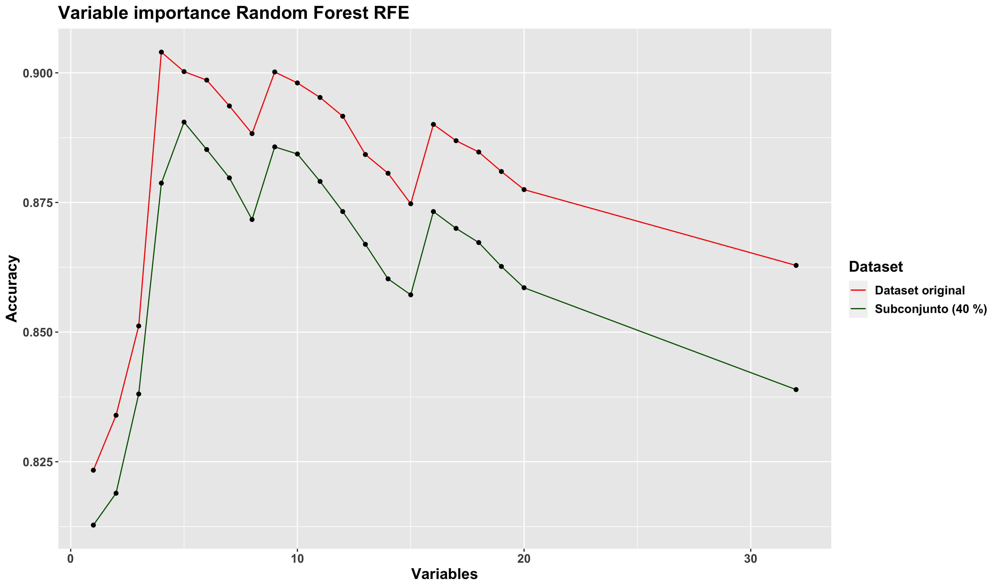
```

## 4.6 Selección bajo logística

### 4.6.1 Comparación datasets
A continuación, y una vez realizada la selección de variables tanto por AIC/BIC como por RFE, __realizamos una primera comparación, bajo logística, de la selección de variables obtenidas en los métodos anteriores, tanto con el _dataset_ original como con el subconjunto__:

```{r, out.width="99%", out.height="99%", fig.align="center", fig.cap="Comparacion bajo logística (I)", echo=FALSE}

```

Como primera impresión, y dada la escala del eje Y, la diferencia en cuanto a tasa de fallos y AUC se refiere es muy pequeña, concretamente de 0.01, aproximadamente (0.21 en tasa de fallos y 0.79 en AUC frente a 0.22 y 0.78).

Por tanto, dado que la diferencia entre ambos _datasets_ es pequeña, __de cara al resto de la práctica se trabajó con el subconjunto del 40 %__. No obstante, en los últimos apartados (y una vez tuneados los modelos), se realiza una última comparación con el fichero original, comprobando de este modo si el orden de los algoritmos se conserva. Además, de cara a la evaluación de los modelos se ha tomado la decisión de utilizar el resto de observaciones del _dataset_ original como conjunto _test_ __con el que evaluar (como primera impresión) la precisión del modelo__.

### 4.6.2 Selección de los mejores sets de variables

Una vez realizada la comparación con el _dataset_ original, nos centramos en la selección de variables obtenida por el subconjunto, tanto por _stepwise AIC/BIC_ como por RFE. En primer lugar, y remontándonos al daigrama de cajas anterior, debemos recordar la diferencia en el número de variables entre _stepwise AIC_ y _BIC_: con 14 y 9 variables, respectivamente, __la tasa de fallos es prácticamente idéntica, y en relación al valor AUC, la diferencia es de tan solo unas milésimas, pues ambos modelos se sitúan en torno a 0.78__. Por tanto, el hecho de incluir demasiadas variables __no afecta en gran medida al modelo, lo cual puede traducirse en un sobreajuste en el resto de algoritmos__.

En consecuencia, en ambas selecciones __probamos a eliminar las variables categóricas menos relevantes, concretamente aquellas con un menor poder predictivo__, tal y como pudimos observar en el apartado de depuración, gracias al __Valor de Información__:

1. En el caso de _stepwise AIC_, eliminamos los campos _baseline_cvd_, _asa_status.0_ y _baseline_diabetes_ (iv: 0.04, 0.0062 y 0.0013, respectivamente).

2. En el caso de _stepwise BIC_, eliminamos el campo _asa_status.0_ (iv: 0.0062).

```{r, echo=FALSE}
data.frame(n = seq(1,11), setpwise_aic = c("mortality_rsi", "ccsMort30Rate", "bmi", "month.8", "dow.0", "Age", "moonphase.0", "month.0", "baseline_osteoart", "baseline_charlson", "ahrq_ccs"),
                        stepwise_bic = c("mortality_rsi", "ccsMort30Rate", "bmi", "month.8", "dow.0", "Age", "moonphase.0", "baseline_osteoart", "-", "-", "-"))
```

Analicemos tanto la tasa de fallos como el valor AUC:

```{r, out.width="97%", out.height="97%", fig.align="center", fig.cap="Comparacion bajo logística (II)", echo=FALSE}
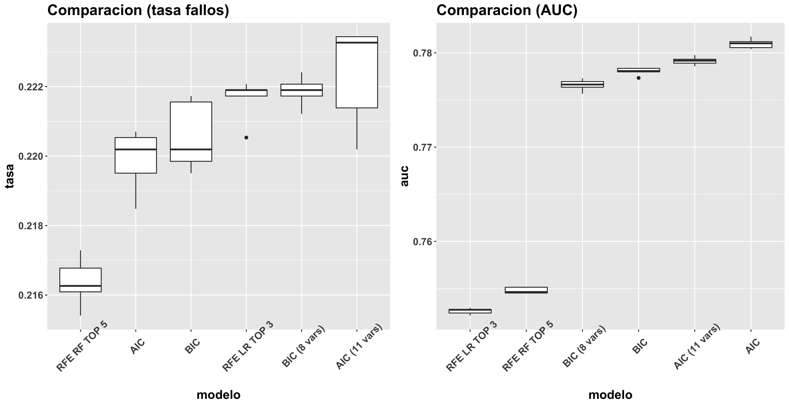
```

Incluso reduciendo el número de variables en ambos casos, aunque la tasa de fallos aumente o el valor auc disiminuya ligeramente, la diferencia no es muy significativa.

No obstante, uno de los aspectos que más ha llamada la atención ha sido la selección de variables RFE con Random Forest, donde con tan solo 5 variables la accuracy aumentaba hasta cerca del 90 %, mucho más alto que un modelo logístico. Por tanto, ¿Y si entrenamos un pequeño modelo random forest para observar la importancia de las variables tanto en _stepwise AIC_ como en _BIC_?

```{r, eval=FALSE}
#-- mtry (sqrt(numero de variables), por defecto)
rf_modelo_bic <- train_rf_model(surgical_dataset, formula.candidato.bic.2, ntree = 1000, 
                                grupos = 5, repe = 5, nodesize = 10, seed = 1234)
```

```{r, out.width="99%", out.height="99%", fig.align="center", fig.cap="Importancia variables Random Forest (AIC y BIC)", echo=FALSE}
knitr::include_graphics('./charts/01_feature_selection_comparacion_random_forest.png')
```

Analizando el gráfico de importancia, caben destacar cuatro principales variables, __las cuales coinciden en ambos modelos, tanto en _stepwise AIC_ como _BIC___: _Age_, _mortality_rsi_, _bmi_ y _ccsMort30Rate_. Por otro lado, en el modelo _AIC_ cabe destacar, además, la variable _ahrq_ccs_. En relación con el modelo _BIC_, el contraste entre las cuatro primeras variables y el resto de _features_ es más significativo, de las cuales caben destacar _baseline_osteoart_ y _month.8_, con un nivel de importancia similar en el _Random Forest_.

Por tanto, vista la importancia que presentan las variables en el modelo _Random Forest_, cabría preguntarse si realmente es necesario un modelo con 11 u 8 variables, como es el caso de _stepwise AIC_ o _BIC_, respectivamente. Es decir, ¿Y si reducimos el modelo a las 4-5 variables más relevantes? Por ejemplo, una última comparación bajo logística consistiría en (y en base al gráfico de importancia anterior) analizar un modelo con las cuatro variables más importantes:

1. _Age_, _mortality_rsi_, _bmi_ y _ccsMort30Rate_.

Otro modelo logístico con las cinco variables más relevantes del _set_ de variables _BIC_:

2. _Age_, _mortality_rsi_, _bmi_, _ccsMort30Rate_ y _ahrq_css_ (coincide con con el modelo obtenido en _RFE_ con _Random Forest_, por lo que lo denotamos como _RFE RF TOP 5 (AIC TOP 5)_).

Además de otros dos modelos con las cinco variables más relevantes en el _set_ de variables _AIC_ (dado que _baseline_osteoart_ y _month.8_ son muy similares en cuanto a importancia se refiere, realizamos la prueba con ambos _sets_):

3. _Age_, _mortality_rsi_, _bmi_, _ccsMort30Rate_ y _baseline_osteoart_.
4. _Age_, _mortality_rsi_, _bmi_, _ccsMort30Rate_ y _month.8_.

```{r, out.width="99%", out.height="99%", fig.align="center", fig.cap="Comparacion bajo logística (III)", echo=FALSE}
knitr::include_graphics('./charts/01_feature_selection_comparacion_final.png')
```

Como podemos comprobar, aunque la tasa de fallos sea similar tanto con _basline_osteoart_ como con _month.8_, el valor AUC es ligeramente superior, incluso cercano a los valores obtenidos por la selección _AIC_, _BIC_ original. Por otro lado, con tan solo cuatro variables, aunque el valor AUC sea ligeramente inferior con respecto al resto de _sets_, la diferencia no es tan significativa (0.755 a 0.775, aproximadamente).

Por tanto, de cara al resto de modelos __emplamos dos modelos candidatos__:

```{r, echo=FALSE}
data.frame(n = seq(1,5), modelo1 = c("Age", "mortality_rsi", "bmi", "ccsMort30Rate", "month.8"),
                        modelo2 = c("Age", "mortality_rsi", "bmi", "ccsMort30Rate", "-"))
```

```{r}
#--- Variables de los modelos candidatos
#--  Modelo 1
var_modelo1 <- c("mortality_rsi", "ccsMort30Rate", "bmi", "month.8", "Age")

#-- Modelo 2
var_modelo2 <- c("mortality_rsi", "bmi", "month.8", "Age")
```

## 4.7 Tuneo y comparación final

Finalmente, realizamos una última comparación de ambos modelos candidatos, __aumentando la validación cruzada de 5 a 10 repeticiones__:


```{r, out.width="99%", out.height="99%", fig.align="center", fig.cap="Comparacion final logística (5-10 rep.)", echo=FALSE}
knitr::include_graphics('./charts/01_feature_selection_comparacion_5_10_rep.png')
```

A primera vista, al aumentar el número de repeticiones, la varianza en ambos modelos es muy similar, con una ventaja en el segundo modelo en cuanto a AUC se refiere (0.775 frente a 0.755, aproximadamente). Por otro lado, si nos fijamos en las estadísticas obtenidas a partir de los datos _test_:

```{r, echo=FALSE}
data.frame(modelo = c("Modelo 1 (BIC TOP 5)", "Modelo 2 (top 4)"),
           precision = c(0.794, 0.7824),
           sensibilidad = c(0.67730, 0.66707), especificidad = c(0.81011, 0.79434),
           valor_pred_pos = c(0.33013, 0.25194), valor_pred_neg = c(0.94783, 0.95830))
```

Observamos que la sensibilidad de ambos modelos ronda el 66-67 %, mientras que la especificidad aumenta hasta el 80 %, aproximadamente. Es decir, con un modelo lineal como es el caso de la regresión logística conseguimos clasificar la mayoría de los pacientes a 0 (sin complicaciones). Sin embargo, tanto el valor predictivo positivo como la sensibilidad nos indican justo con lo contrario en relación a los pacientes con complicaciones: 

1. __Valor predictivo positivo__ (en torno al 25-33 % en ambos modelos), lo que se traduce en un alto número de falsos positivos.

2. __Sensbilidad__ (en torno al 66-67 % en ambos modelos), lo que se traduce en un alto número de falsos negativos.

# 5. Modelos iniciales con H2O

Una realizada la selección de variables y decantarnos por dos posibles _sets_ de variables, antes de comenzar con el tuneo de hiperparámetros, __realizamos un modelo _autoML_ por cada _set_ de variables__. De este modo, podremos comprobar, de forma orientativa:

1. Qué modelo o modelos son los más adecuados, tanto a nivel AUC como en tasa de fallos.
2. Del mejor o mejores modelos, qué parámetros se ha empleado.

## 5.1 Modelo 1 (BIC TOP 5)

```{r, eval=FALSE}
#   Modelo 1
aml_1 <- h2o.automl(x = var_modelo1, y = target, 
                    training_frame = surgical_dataset_h, nfolds = 5, seed = 1234,
                    balance_classes = TRUE, keep_cross_validation_predictions = TRUE,
                    max_models = 10)
```

```
                                              model_id       auc   logloss mean_per_class_error
1                         GBM_5_AutoML_20210422_174850 0.9211350 0.2591059            0.1608837
2  StackedEnsemble_BestOfFamily_AutoML_20210422_174850 0.9208431 0.2647496            0.1603029
3                         GBM_1_AutoML_20210422_174850 0.9200581 0.2690935            0.1659645
4     StackedEnsemble_AllModels_AutoML_20210422_174850 0.9200033 0.2647962            0.1676764
5                         GBM_2_AutoML_20210422_174850 0.9190857 0.2695043            0.1648937
6                     XGBoost_3_AutoML_20210422_174850 0.9189663 0.2613378            0.1651901
7       XGBoost_grid__1_AutoML_20210422_174850_model_1 0.9189402 0.2629065            0.1675371
8           GBM_grid__1_AutoML_20210422_174850_model_1 0.9187735 0.2763313            0.1689585
9                         GBM_3_AutoML_20210422_174850 0.9175951 0.2725404            0.1757392
10                    XGBoost_2_AutoML_20210422_174850 0.9169047 0.2717032            0.1707306
```

En un primer análisis, de todos los modelos _autoML_ creados, __los modelos _gradient boosting_, _ensemble_ y _xgboost_ obtienen los mejores resultados__, con un AUC en torno a 0.92, así como un error medio por cada clase de 0.16-0.17, aproximadamente. Por otro lado, si analizamos los parámetros del mejor modelo, concretamente _gradient boosting_:

```{r, echo=FALSE}
data.frame(modelo = c("Modelo 1 (BIC TOP 5)"),
           ntrees = c(82),
           max_depth = c(15), sample_rate = c(0.8),
           col_sample_rate = c(0.8), col_sample_rate_per_tree = c(0.8))
```

Analizando los parámetros, por lo general _h2o_ __opta por un modelo _gbm_ sencillo, con un número bajo de árboles (inferior a 100), un profundidad moderada en cada árbol (15), además de sortear no solo observaciones, sino además variables (en torno al 80 %)__.

## 5.2 Modelo 2 (AIC-BIC top 4)

```
                                              model_id       auc   logloss  mean_per_class_error
1                         GBM_5_AutoML_20210422_182719 0.9096419 0.2700148            0.1646700
2  StackedEnsemble_BestOfFamily_AutoML_20210422_182719 0.9088350 0.2712222            0.1666722
3     StackedEnsemble_AllModels_AutoML_20210422_182719 0.9083655 0.2708531            0.1683963
4                     XGBoost_3_AutoML_20210422_182719 0.9083145 0.2683037            0.1735557
5                         GBM_1_AutoML_20210422_182719 0.9075638 0.2769396            0.1730899
6                         GBM_2_AutoML_20210422_182719 0.9072236 0.2767946            0.1770094
7       XGBoost_grid__1_AutoML_20210422_182719_model_1 0.9065834 0.2696259            0.1678335
8                     XGBoost_2_AutoML_20210422_182719 0.9064648 0.2756899            0.1671682
9                     XGBoost_1_AutoML_20210422_182719 0.9047755 0.2746863            0.1725274
10          GBM_grid__1_AutoML_20210422_182719_model_1 0.9044822 0.3115999            0.1720491
```

Nuevamente, con el segundo _set_ de variables continua optando por un modelo _grandient boosting_, con un AUC muy similar al primer _set_ de variables (0.90 frente a 0.92). Además, si analizamos los parámetros del mejor modelo:

```{r, echo=FALSE}
data.frame(modelo = c("Modelo 1 (BIC TOP 5)", "Modelo 2 (AIC-BIC-top4)"),
           ntrees = c(82, 72),
           max_depth = c(15, 15), sample_rate = c(0.8, 0.8),
           col_sample_rate = c(0.8, 0.8), col_sample_rate_per_tree = c(0.8, 0.8))
```

Salvo el número de árboles, el resto de parámetros coinciden. Por tanto, de cara a la elaboración de los modelos, __comprobaremos si el mejor modelo en ambos _sets_ es, efectivamente, un modelo _gbm_, o si al menos está entre los mejores__.

# 6. Redes neuronales

## 6.1 Modelo 1 (BIC TOP 5)

A continuación, procedemos con el tuneado del primer modelo _Machine Learning_: la red neuronal, comenzando con el primer _set_ (5 variables input). En primera instancia, analicemos el número de nodos necesario para obtener entre 20 y 30 observaciones por parámetro, teniendo 5 variables _input_:

1. Con 20 observaciones por parámetro: 
$$
h * (k + 1) + h + 1 = 5854 / 20 = 292 \text{ parámetros}
$$
$$
\text{Con } k = 5 \text{ variables input, entonces: } 7 * h + 1 = 292. \text{ Es decir}, 41-42 \text{ nodos}
$$

2. Con 30 observaciones por parámetro: 
$$
h * (k + 1) + h + 1 = 5854 / 30 = 195 \text{ parámetros}
$$
$$
\text{Con } k = 5 \text{ variables input, entonces: } 7 * h + 1 = 195 \text{. Es decir}, 27-28 \text{ nodos}
$$

En primera instancia, dado que dispone de tan solo cinco variables , probablemente no serán necesarios tantos nodos. No obstante, realizamos un primer tuneo con varios tamaños (desde 5 hasta 40):

```{r, eval=FALSE}
size.candidato.1 <- c(5, 10, 15, 20, 25, 30, 35, 40)
decay.candidato.1 <- c(0.1, 0.01, 0.001)

cvnnet.candidato.1 <- cruzadaavnnetbin(data=surgical_dataset,vardep=target,
                                       listconti=var_modelo1, listclass=c(""),
                                       grupos=5,sinicio=1234,repe=5, size=size.candidato.1,
                                       decay=decay.candidato.1,repeticiones=5,itera=200)
```

```{r, echo=FALSE}
df <- readxl::read_excel("excel_modelos.xlsx", sheet = "modelo1")
df$id <- c(1:24)
as.data.frame(df)
```

Analizando la tabla anterior, empleando un _decay_ o _learning_rate_ de 0.01, __el modelo obtiene muy buenos resultados, mejores incluso que la regresión logística, un indicativo de la no linealidad de las variables__. Por otro lado, y en relación con el número de nodos ¿Merece aumentar hasta 20, 30 o incluso 40 nodos? En vista a los resultados, no lo parece. A modo de ejemplo, con tan solo 15 nodos y un _decay_ de 0.01, el valor de _accuracy_ alcanza un 89 %, mientras que con 20, 30 o 40 nodos, la diferencia es de tan solo unas milésimas (no estamos ganando lo suficiente como para decantarnos por un modelo más complejo). Por tanto, una buena alternativa sería emplear 15 nodos (10 tampoco sería una mala opción, aunque comienza a decaer hasta el 87 %).

No obstante, con un _decay_ de 0.01, analicemos tanto el sesgo como la varianza en base al número de nodos:

```{r, out.width="99%", out.height="99%", fig.align="center", fig.cap="Comparacion avnnet modelo 1", echo=FALSE}
knitr::include_graphics("./charts/02_comparacion_tasa_auc_modelo1.png")
```

Como primera impresión, y en base al mejor AUC, un modelo con 20, 25 o 30 nodos sería una buena alternativa, de no ser por un aspecto clave: __la escala de los ejes__. En relación con la tasa de fallos, la diferencia de error entre un modelo con 15 nodos y un modelo con 20 es muy pequeña (de 0.11 a 0.105), además de que la varianza del modelo con 15 nodos (elevada desde un punto de vista gráfico), la escala del eje puede llevar a engaño, dado que sus valores de error oscilan entre 0.1075 y 0.11. Por otro lado, la diferencia del AUC entre un modelo con 15 nodos y un modelo con 20 es muy pequeña (en torno 0.8925-0.895 en el caso de 15 nodos y 0.895-0.90 en el caso de 20 nodos). 

De hecho, si aumentamos el número de repeticiones a 10:

```{r, out.width="99%", out.height="99%", fig.align="center", fig.cap="Comparacion avnnet modelo 1 (10 rep.)", echo=FALSE}
knitr::include_graphics("./charts/02_comparacion_tasa_auc_modelo1_10rep.png")
```

Comprobamos que tanto el orden de los diferentes modelos como su varianza se mantienen prácticamente constante. En conclusión, con el primer _set_ de variables __nos decantamos por un modelo de red con 15 nodos__, dado que la ganancia que supone al aumentar el número de nodos, tanto en AUC como en tasa de fallos, es muy pequeña.

A continuación, y aumentando a 10 el número de repeticiones, tuneamos el número de iteraciones:

```{r, out.width="99%", out.height="99%", fig.align="center", fig.cap="Comparacion avnnet modelo 1 (iteraciones)", echo=FALSE}

```

Analizando los resultados, __bien es cierto que conforme aumenta el número de iteraciones, tanto la tasa de fallos como el AUC comienzan a estabilizarse__. No obstante, la ganancia que supone aumentar el número de iteraciones es muy pequeña. A modo de ejemplo, de 200 a 300 iteraciones, la tasa de fallos mejora de 0.11 a 0.105, aproximadamente, mientras que el valor AUC apenas se ve afectado. Por tanto, __mantenemos el número de iteraciones a 200__.

## 6.2 Modelo 2 (AIC-BIC TOP 4)

A continuación, realizamos los mismos pasos con el segundo _set_ de variables candidato. En primer lugar, y dado que disponemos de 4 variables _input_, para obtener 20 o 30 observaciones por parámetros necesitamos:

1. Con 20 observaciones por parámetro: 

$$
\text{Con } k = 4 \text{ variables input, entonces: } 6 * h + 1 = 292. \text{ Es decir}, 48-49 \text{ nodos}
$$

2. Con 30 observaciones por parámetro: 
$$
\text{Con } k = 4 \text{ variables input, entonces: } 6 * h + 1 = 195 \text{. Es decir}, 27-28 \text{ nodos}
$$

Con un primer cálculo, necesitaríamos un elevado número de nodos para obtener, al menos, 20 o 30 observaciones por parámetro. Sin embargo, si nos fijamos en lo empírico:

```{r, eval=FALSE}
size.candidato.2 <- c(5, 10, 15, 20, 25, 30, 35, 40, 45)
decay.candidato.2 <- c(0.1, 0.01, 0.001)

cvnnet.candidato.1 <- cruzadaavnnetbin(data=surgical_dataset,vardep=target,
                                       listconti=var_modelo2, listclass=c(""),
                                       grupos=5,sinicio=1234,repe=5, size=size.candidato.1,
                                       decay=decay.candidato.1,repeticiones=5,itera=200)
```

```{r, echo=FALSE}
df <- readxl::read_excel("excel_modelos.xlsx", sheet = "modelo2")
df$id <- c(1:27)
as.data.frame(df)
```

En un primer resultado, __con un parámetro de regularización pequeño obtenemos buenos resultados__. A modo de ejemplo, llama la atención modelos de red con 20, 25 o 30 nodos que alcanzan un _Accuracy_ de 0.90. Sin embargo, conforme descendemos en la tabla (y con ello, el número de nodos) comprobamos que la diferencia no es muy significativa: con tan solo 15 o 10 nodos y un _decay_ de 0.01, el valor de _Accuracy_ tan solo empeora en 0.89. Es decir, a simple vista el hecho de aumentar el número de nodos __no compensa la ganancia de _Accuracy___. 

No obstante, analicemos tanto el sesgo como la varianza con los mejores modelos:

```{r, eval=FALSE}
# Probamos con 15-20-25-30 nodos y decay 0.001; 10-15 nodos y decay 0.01
size.candidato.2  <- c(10, 15, 15, 20, 25, 30)
decay.candidato.2 <- c(0.01, 0.01, 0.001, 0.001, 0.001, 0.001)
```

```{r, out.width="99%", out.height="99%", fig.align="center", fig.cap="Comparacion avnnet modelo 2", echo=FALSE}
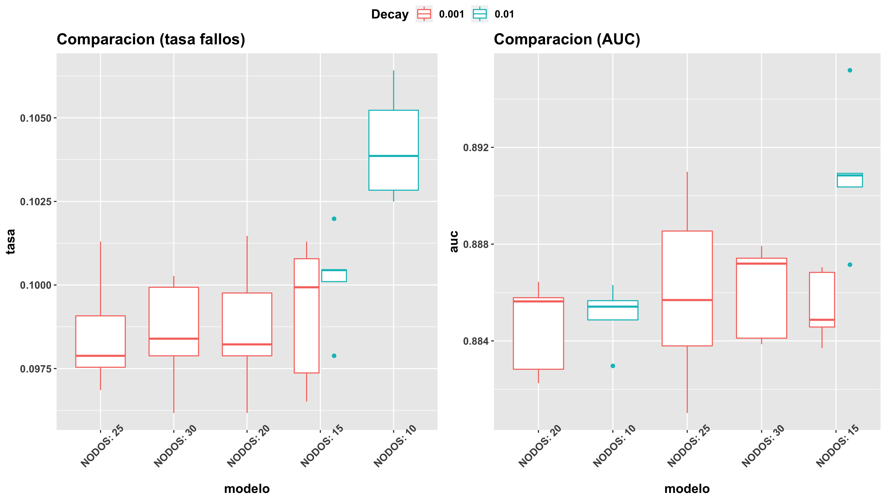
```

En un primer resultado, __la ganancia de error que supone reducir el número de nodos a 10 (y con un _decay_ de 0.01), es muy pequeña: de 0.09 con 25 nodos a 0.105 con tan solo 10 nodos__. Del mismo modo sucede con el área bajo la curva, donde la mejora con 15 o 30 nodos es de tan solo unas milésimas de diferencia, lo cual puede depender de condiciones azarosas como la semilla de aleatoriedad. No obstante, con 10, 15 y 20 nodos, echemos un vistazo al modelo con 10 repeticiones:

```{r, out.width="99%", out.height="99%", fig.align="center", fig.cap="Comparacion avnnet modelo 2 (10 rep.)", echo=FALSE}

```

Incluso aumentando a 10 repeticiones, el orden de los modelos no cambia. Por tanto, dada su simplicidad y la poca ganancia de error que supone, __elegimos el modelo con 10 nodos y _decay_ 0.01__.

Por último, tuneamos el número de iteraciones:

```{r, out.width="99%", out.height="99%", fig.align="center", fig.cap="Comparacion avnnet modelo 2 (iteraciones)", echo=FALSE}
knitr::include_graphics("./charts/02_comparacion_tasa_auc_modelo2_10rep_iters.png")
```

Del mismo modo que sucedía con el primer _set_ de variables, __aumentar el número de iteraciones no supone una mejoría significativa__, por lo que lo mantenemos a 200.

## 6.3 Comparación final

Una vez obtenidos ambos modelos, con los datos _test_ realizamos las primeras predicciones:

```{r, echo=FALSE}
data.frame(modelo = c("Modelo 1 (BIC TOP 5)", "Modelo 2 (top 4)"),
           precision = c(0.8992, 0.9032),
           sensibilidad = c(0.9471, 0.9639), especificidad = c(0.8897, 0.8913),
           valor_pred_pos = c(0.6305, 0.6351), valor_pred_neg = c(0.9883, 0.9921))
```

En primera instancia, __con un modelo de red sencillo conseguimos mejorar prácticamente en todos los aspectos__. No obstante, cabe destacar el valor predictivo positivo, que pese a su mejoría (del 20-30 al 63 %), __continua existiendo un alto porcentaje de falsos positivos__.

En conclusión, a la vista de los resultados obtenidos, tanto en tasa de fallos como en AUC, __los modelos de red mejoran significativamente los resultados del modelo__, un claro indicio de la __no linealidad con la variable objetivo__. En relación con ambos _set_ de variables, el hecho de añadir una variable _input_ adicional en el primer modelo __no hace mejorar significativamente sus resultados__:

```{r, out.width="99%", out.height="99%", fig.align="center", fig.cap="Comparacion tasa fallos log-avnnet", echo=FALSE}
knitr::include_graphics("./charts/comparativas/02_log_avnnet_tasa.jpeg")
```
```{r, out.width="99%", out.height="99%", fig.align="center", fig.cap="Comparacion AUC log-avnnet", echo=FALSE}
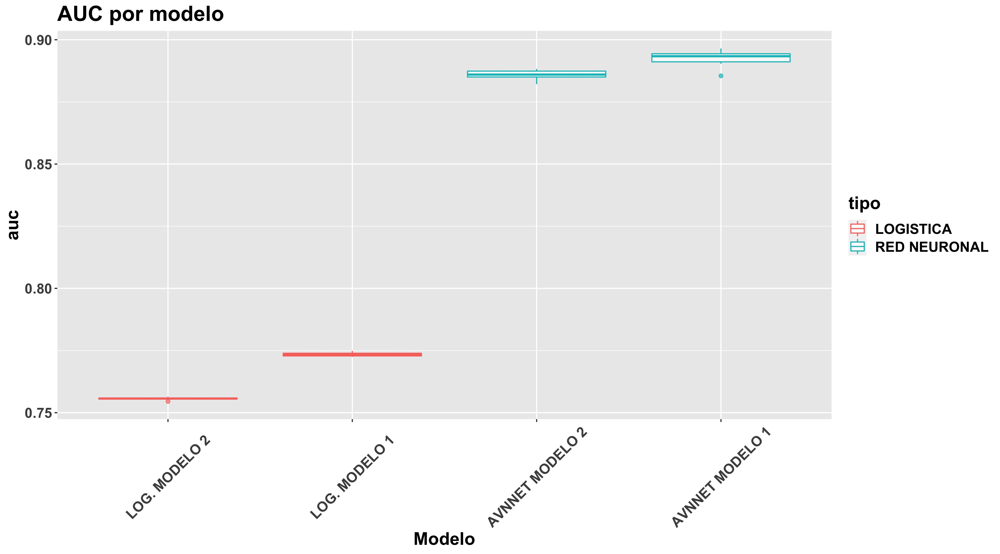
```

__RESUMEN red neuronal__:

1. modelo 1: _size_ = 15 y _decay_ = 0.01.
2. modelo 2: _size_ = 10 y _decay_ = 0.01.

# 7. Bagging

## 7.1 Selección del número de árboles

Continuando con el modelo _bagging_, de forma previa al tuneo de hipérparametros, debemos fijar un número de árboles (ntrees) para ambos _sets_ de variables, un valor mínimo a partir del cual el error OOB ( _Out of bag error_ ) se estabiliza:

```{r, eval=FALSE}
#-- Seleccion del numero de arboles
set.seed(1234)
#-- Modelo 1
rfbis.1<-randomForest(factor(target)~mortality_rsi+ccsMort30Rate+bmi+month.8+Age,
                      data=surgical_dataset,
                      mtry=mtry.1,ntree=5000,nodesize=10,replace=TRUE)

#-- Modelo 2
rfbis.2<-randomForest(factor(target)~Age+mortality_rsi+bmi+month.8,
                      data=surgical_dataset,
                      mtry=mtry.2,ntree=5000,nodesize=10,replace=TRUE)
```

```{r, out.width="99%", out.height="99%", fig.align="center", fig.cap="OOB Error (Modelos 1 y 2) (I)", echo=FALSE}

```

Analizando el error _Out of bag_, __en ambos modelos el error se estabiliza con aproximadamente 1000 árboles, obteniendo valores de error inferiores a 0.1, similares a los obtenidos en los modelos de red__. Si hacemos _zoom_ sobre el gráfico:

```{r, out.width="99%", out.height="99%", fig.align="center", fig.cap="OOB Error (Modelos 1 y 2) (II)", echo=FALSE}
knitr::include_graphics("./charts/OOB_2.png")
```

Observamos como a partir de 200-250 árboles, el error comienza a situarse por debajo de 0.10. Sin embargo, __no es hasta los 900-1000 árboles cuando el error prácticamente se estabiliza, a partir del cual se detectan ciertas fluctuaciones (subidas o bajadas en el error), aunque de forma aleatoria__. Por tanto, __para ambos modelos escogemos 900 como número de árboles__.

```{r, eval=FALSE}
n.trees.1 <- 900; n.trees.2 <- 900
```

## 7.2 Modelo 1

En un primer comienzo, hagamos un repaso previo de los parámetros a tunear en un modelo _bagging_, junto con el número de árboles:

_mtry_: número de variables sorteadas aleatoriamente en cada división del árbol. Dado que se trata de un modelo _bagging_, __establecemos en dicho parámetro el número total de variables independientes del modelo__.

_nodesize_: tamaño máximo de nodos finales.

_sampsize_: número de observaciones seleccionadas aleatoriamente (con o sin reemplazamiento) para la construcción del árbol.

_replace_: si el sorteo anterior se realiza con o sin reemplazamiento (por defecto, con reemplazamiento).

Dado que _mtry_ debe corresponder con el número de variables _input_ y el número de árboles ya está definido, quedan por tunear tanto _nodesize_ como _sampsize_ y _replace_. Por tanto, __comenzamos ajustando tanto el tamaño de la submuestra como el tamaño máximo de nodos finales__ (en el caso del parámetro _replace_, una vez obtenidos los modelos _bagging_ para ambos _sets_, con el mejor de ambos probaremos a seleccionar muestras sin reemplazamiento).

Antes de tunear _sampsize_, y dado que estamos trabajando con validación cruzada, __dispondremos de menos observaciones para construir el modelo, de forma que debemos establecer un tamaño máximo sobre dicho parámetro__. Concretamente, dado que disponemos de 5854 observaciones y 5 grupos de validación cruzada, cada grupo tendrá disponible 5854 * (4/5) ~ 4683 observaciones, siendo el tamaño máximo de muestra que podemos probar:

```{r, eval=FALSE}
mtry.1      <- 5
#-- Redondeamos 4683 a 4600
sampsizes.1 <- list(1, 100, 500, 1000, 2000, 3000, 4600)
nodesizes.1 <- list(5, 10, 20, 30, 40, 50, 100)

bagging_modelo1 <- tuneo_bagging(surgical_dataset, target = target,
                                 lista.continua = var_modelo1,
                                 nodesizes = nodesizes.1,
                                 sampsizes = sampsizes.1, mtry = mtry.1,
                                 ntree = n.trees.1, grupos = 5, repe = 5)
```

A continuación, por cada combinación _nodesize_ - _sampsize_ mostramos el promedio tanto de la tasa de fallos como de AUC:

```{r, out.width="99%", out.height="99%", fig.align="center", fig.cap="Distribucion de la tasa de fallos y AUC por sampsize y nodesize (Modelo 1) (I)", echo=FALSE}
knitr::include_graphics('./charts/03_distribucion_auc_tasa_fallos_modelo1.png')
```

En un primer análisis, caben destacar fundamentalmente dos aspectos:

1. En relación al _nodesize_, tanto en tasa de fallos como en AUC, se obtienen buenos resultados en torno a un valor de 5-30, aproximadamente, pues a partir de 50-100 (árboles menos complejos), la precisión del modelo comienza a disminuir. Sin embargo, ¿Merece la pena aumentar la complejidad del árbol, disminuyendo el parámetro _nodesize_? A simple vista, la diferencia entre un modelo de mayor complejidad ( _nodesize_ = 5 ), y un modelo de menor complejidad ( _nodesize_ = 20 ), es muy pequeña (punto rojo y verde). __Por tanto, una posibilidad sería decantarse por un _nodesize_ elevado, en torno a 20.__

2. Por otro lado, llama la atención el tuneo sobre el parámetro _sampsize_. Bien es cierto que conforme aumenta el tamaño de la submuestra, mayor es la precisión. No obstante, ¿Qué diferencia existe entre un modelo en el que se utilizan todas las observaciones ( _sampsize_ = 1 ) y un modelo con tan solo 500 o 1000 submuestras? No hay demasiada diferencia, en especial con un _nodesize_ en torno a 20, tal y como comentamos en el apartado anterior. De este modo, y gracias además al elevado número de árboles del que disponemos (900), __un valor _sampsize_ bajo permite no solo reducir el tiempo de cómputo para entrenar el modelo, sino además una mayor variedad en la construcción de cada uno de los árboles__.

Es decir, para obtener un buen modelo _bagging_ __no es necesario emplear todas las observaciones, ni tampoco árboles con demasiada complejidad__, sino que con pocas muestras (en torno a 500), y un _nodesize_ alto (en torno a 20), se obtienen muy buenos resultados. Por tanto, una vez realizado el primer análisis, realizamos una comparación (tanto del sesgo como de la varianza) sobre modelos _bagging_ con un valor _nodesize_ pequeño (5), lo que se traduce en árboles más complejos, frente a modelos con un valor alto (en torno a 20). Del mismo modo, analizamos el sesgo y varianza con diferentes valores de _sampsize_, aumentando a 10 el número de repeticiones para observar mejor su efecto:

```{r, eval=FALSE}
nodesizes.1 <- list(5, 20)
#-- Probamos con un sampsize entre 500 y 2000 observaciones (1 = todas las observaciones)
sampsizes.1 <- list(1, 500, 1000, 1500, 2000)
bagging_modelo1_v2 <- tuneo_bagging(surgical_dataset, target = target,
                                    lista.continua = var_modelo1,
                                    nodesizes = nodesizes.1,
                                    sampsizes = sampsizes.1, mtry = mtry.1,
                                    ntree = n.trees.1, grupos = 5, repe = 10,
                                    show_nrnodes = "yes")
```

```{r, out.width="99%", out.height="99%", fig.align="center", fig.cap="Distribucion de la tasa de fallos y AUC por sampsize y nodesize (Modelo 1) (II)", echo=FALSE}

```

Nuevamente, sin fijarnos en la escala del eje, una posible opción a decantarse sería elegir un modelo con _nodesize_ 5 y _sampsize_ 1000, pues presenta el mayor valor AUC y una tasa de fallos baja. No obstante, los valores del eje pueden llevarnos a engaño. Por ejemplo, la diferencia entre este modelo y uno mucho más sencillo como es el caso de _nodesize_ 20 y _sampsize_ en torno a 500-1000 (20 + 500 o 20 + 1000) es muy pequeña (hablamos de una tasa de fallos en torno a 0.10 y un AUC de 0.91, por lo que la diferencia es del órden de milésimas), incluso con un menor número de muestras la varianza de los modelos se ve reducida en comparación con usar todas las observaciones, aunque la diferencia (por las escalas del eje) sea menor.

Sin embargo, ¿Y si aumentamos _nodesize_ a 50? 

```{r, out.width="99%", out.height="99%", fig.align="center", fig.cap="Distribucion de la tasa de fallos y AUC por sampsize y nodesize (Modelo 1) (III)", echo=FALSE}

```

A simple vista, __los resultados obtenidos son muy similares en ambos casos__, especialmente en _AUC_, donde la diferencia entre el mejor modelo (20 + 1500) y el peor (50 + 500) es de tan solo 0.01. Sin embargo, y en relación con la tasa de fallos, para alcanzar un valor en torno al 10 % con un _nodesize_ = 50, se requiere por lo general un mayor tamaño de submuestra, dado que la complejidad del árbol es menor. Sin embargo, con un valor _nodesize_ menor (20), se requieren menos observaciones.

Por tanto, dada la poca ganancia que presentan los modelos complejos, __nos decantamos por un modelo _bagging_ con _nodesize_ = 20 y un tamaño de muestra en torno a 500 y 1000__. Sobre ambos candidatos, para controlar mejor el tamaño óptimo de la muestra, probamos con una validación cruzada de 10 grupos y 20 repeticiones:

```{r, out.width="99%", out.height="99%", fig.align="center", fig.cap="Distribucion de la tasa de fallos y AUC (Modelo 1) aumentando grupos y repeticiones", echo=FALSE}

```

Por lo general, incluso aumentando el número de grupos y repeticiones, el orden de los modelos se mantiene idéntico, tanto en tasa de fallos como en AUC. Por tanto, de los dos posibles modelos candidatos (con _sampsize_ 500 o 1000), aunque la diferencia entre ambos, así como el sesgo y varianza no sean muy significativas (dada la escala de los ejes), __nos decantamos por un modelo con un tamaño de 1000 submuestras__, es decir, con tan solo el 1000 / 5854 ~ 17 % de las observaciones.

## 7.3 Modelo 2

Del mismo modo, realizamos los mismos pasos con el segundo _set_ de cuatro variables, comenzando con el tuneo tanto de _nodesize_ como de _sampsize_, obteniendo el promedio en tasa de fallos y AUC con 5 repeticiones:

```{r, eval=FALSE}
mtry.2      <- 4
sampsizes.2 <- list(1, 100, 500, 1000, 2000, 3000, 4600)
nodesizes.2 <- list(5, 10, 20, 30, 40, 50, 100)

bagging_modelo1 <- tuneo_bagging(surgical_dataset, target = target,
                                 lista.continua = var_modelo2,
                                 nodesizes = nodesizes.2,
                                 sampsizes = sampsizes.2, mtry = mtry.2,
                                 ntree = n.trees.2, grupos = 5, repe = 5)
```

```{r, out.width="99%", out.height="99%", fig.align="center", fig.cap="Distribucion de la tasa de fallos y AUC por sampsize y nodesize (Modelo 2) (I)", echo=FALSE}

```

Nuevamente, nos encontramos con un comportamiento similar al obtenido con el primer modelo: por un lado, con un valor _nodesize_ moderado/alto (en torno a 20), obtienen buenos resultados, por lo que no es necesario utilizar árboles demasiado complejos, pues la ganancia tanto en tasa de fallos como en AUC es ínfima. Por otro lado, y en relación con _sampsize_, __no es necesario emplear todas las observaciones__, sino que con tan solo 500 o 1000 muestras, el modelo obtiene buenos resultados.

Por tanto, y del mismo modo que en el primer _set_ de variables, __comparamos la diferencia entre un modelo de mayor complejidad ( _nodesize_ = 5 ) y de menor complejidad ( _nodesize_ = 20 ), utilizando diferentes tamaños de _sampsize_:

```{r, eval=FALSE}
nodesizes.2 <- list(5, 20)
#-- Probamos con un sampsize entre 500 y 2000 observaciones (1 = todas las observaciones)
sampsizes.2 <- list(1, 500, 1000, 1500, 2000)
bagging_modelo1_v2 <- tuneo_bagging(surgical_dataset, target = target,
                                    lista.continua = var_modelo2,
                                    nodesizes = nodesizes.2,
                                    sampsizes = sampsizes.2, mtry = mtry.2,
                                    ntree = n.trees.2, grupos = 5, repe = 10,
                                    show_nrnodes = "yes")
```

```{r, out.width="99%", out.height="99%", fig.align="center", fig.cap="Distribucion de la tasa de fallos y AUC por sampsize y nodesize (Modelo 2) (II)", echo=FALSE}

```

De nuevo, el hecho de aumentar la complejidad de los árboles (reduciendo el valor de _nodesize_), no supone una mejoría relevante al modelo. A modo de ejemplo, la diferencia en la tasa de fallos entre un modelo con _nodesize_ 5 (5 + 2000) y un modelo con _nodesize_ 20 (20 + 2500), es de apenas unas milésimas de diferencia (del mismo modo sucede con AUC) ¿Y si aumentamos el valor a 50?

```{r, out.width="99%", out.height="99%", fig.align="center", fig.cap="Distribucion de la tasa de fallos y AUC por sampsize y nodesize (Modelo 2) (III)", echo=FALSE}

```

En base a la escala de los ejes, la diferencia no es muy significativa. Sin embargo y por lo general, con un _nodesize_ = 50 se requiere un mayor número de observaciones, al ser árboles de menor complejidad, mientras que con un _nodesize_ menor, en torno a 20, con tan solo 500 o 1000 observaciones se obtienen prácticamente los mismos resultados.

Por tanto, y del mismo modo que en el primer _set_ de variables, nos decantamos por un _nodesize_ de 20 y un tamaño de muestra en torno a 500-1000 observaciones. Sobre ambos candidatos, probamos de nuevo con una validación cruzada de 10 grupos y 20 repeticiones:

```{r, out.width="99%", out.height="99%", fig.align="center", fig.cap="Distribucion de la tasa de fallos y AUC (Modelo 2) aumentando grupos y repeticiones", echo=FALSE}

```

Incluso aumentando el número de grupos, el orden de los modelos se mantiene prácticamente igual. En conclusión, __nos decantamos por la misma configuración que con el primer _set_ de variables__: _nodesize_ 20 y _sampsize_ 1000.

__RESUMEN _bagging___:

1. modelo 1: _nodesize_ = 20 y _sampsize_ = 1000.
2. modelo 2: _nodesize_ = 20 y _sampsize_ = 1000.

## 7.4  Modelo sin reemplazamiento

Una vez tuneados ambos _sets_ de variables, veamos la diferencia entre un modelo con _sampsize_ con reemplazamiento y sin reemplazamiento:

```{r, eval=FALSE}
#-- ¿Y si lo probamos sin reemplazamiento? Probamos con el mejor modelo en terminos de AUC (modelo 1)
bagging_modelo_sin_reemp <- tuneo_bagging(surgical_dataset, target = target,
                                   lista.continua = var_modelo1, nodesizes = 20, 
                                   sampsizes = 1000, mtry = mtry.1, ntree = n.trees.1, 
                                   grupos = 5, repe = 10, replace = FALSE)
```

```{r, out.width="99%", out.height="99%", fig.align="center", fig.cap="Distribucion de la tasa de fallos y AUC con y sin reemplazamiento", echo=FALSE}
knitr::include_graphics('./charts/bagging/03_comparacion_final_bagging.png')
```

A simple vista, no existe diferencia entre modelos con o sin reemplazamiento en _sampsize_. Por otro lado, y del mismo modo que sucedía con el modelo de red, no existe apenas diferencia entre el primer _set_ con 5 variables y el segundo _set_ con 4, tan solo de 0.01 en el caso del AUC.

## 7.5 Comparación final

Finalmente, realizamos la comparación final de ambos modelos _bagging_ con los datos _test_:

```{r, echo=FALSE}
data.frame(modelo = c("Modelo 1 (BIC TOP 5)", "Modelo 2 (top 4)"),
           precision = c(0.901, 0.9019),
           sensibilidad = c(0.9214, 0.9468), especificidad = c(0.8966, 0.8928),
           valor_pred_pos = c(0.6589, 0.6424), valor_pred_neg = c(0.9813, 0.9880))
```

Por lo general, la estadísticas de las predicciones mejoran ligeramente, aunque se mantienen en la misma línea del modelo de red neuronal: altos porcentajes de sensibilidad, especificidad y valor predictivo negativo, aunque el valor predictivo positivo se sitúa en torno al 64-65 %, aproximadamente, lo cual es un indicativo de la presencia de un alto número de falsos positivos en las predicciones. Además, la diferencia entre el primer modelo _bagging_ (con 5 variables _input_) y el segundo (con tan solo 4), no es muy relevante en base a las estadísticas anteriores. 

Además, si observamos la distribución de la tasa de fallos y AUC en los modelos: 

```{r, out.width="99%", out.height="99%", fig.align="center", fig.cap="Comparacion tasa fallos log-avnnet-bagging", echo=FALSE}

```
```{r, out.width="99%", out.height="99%", fig.align="center", fig.cap="Comparacion AUC log-avnnet-bagging", echo=FALSE}
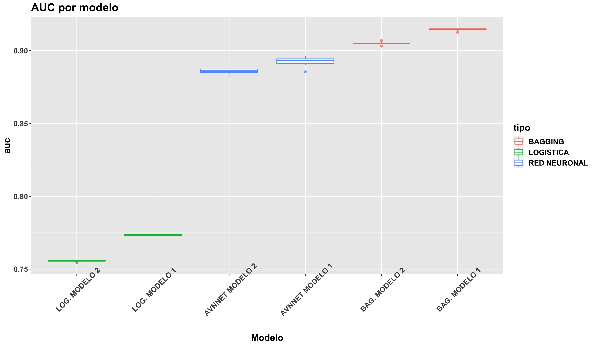
```

De nuevo, la relación no lineal entre las variables _input_ se ve reflejado en los resultados obtenidos tanto en modelos de red como _bagging_, siendo este último caso el que obtiene mejores resultados tanto en tasa de fallos como en AUC, aunque la diferencia (dada la escala de los ejes) no sea muy relevante.

# 8. Random Forest

## 8.1 Selección del número de árboles y mtry

Una vez elaborados los modelos _bagging_, y dado que _Random Forest_ si realiza el sorteo de variables por cada división del árbol ¿Con 900 árboles es suficiente? Para comprobarlo, analicemos en ambos _sets_ la evolución del _ratio_ de error al variar el parámetro _mtry_:

### 8.1.1 Modelo 1

```{r, out.width="99%", out.height="99%", fig.align="center", fig.cap="Error rate (Modelo 1) en función de mtry", echo=FALSE}

```

En primera instancia, observamos que el error (para cualquier _mtry_) se estabiliza prácticamente a partir de 2000 árboles, momento en el que el error _Out of bag_ es estable con _mtry_ = 2. Sin embargo, con otros valores _mtry_, es decir, __sorteando un mayor número de variables__, el error se estabiliza con antelación:

1. _mtry_ = 3: también a partir de 2000 árboles, aproximadamente.
2. _mtry_ = 4: a partir de 1500 árboles, aproximadamente.
3. _mtry_ = 5: a partir de 900 árboles (caso del modelo _bagging_).

Tras una primera impresión, y utilizando 2000 árboles, __lanzamos los primeros modelos _random forest___, utilizando los diferentes valores _mtry_. En relación con el resto de parámetros como _nodesize_ o _sampsize_, __utilizamos los empleados en el modelo _bagging___: 20 + 1000.

```{r, eval=FALSE}
#-- 2500: numero de arboles a partir del cual se estabiliza con mtry = 2
#   Inicialmente, probamos con 5 repeticiones
mtry.1 <- c(2,3,4,5) # mtry = 5 -> modelo bagging
primera.imp <- tuneo_rf(surgical_dataset, target=target,lista.continua=var_modelo1,
                        grupos=5,repe=5,nodesizes=20,mtry=mtry.1,ntree=2000,replace=TRUE, 
                        sampsizes=1000)
```

```{r, out.width="99%", out.height="99%", fig.align="center", fig.cap="Tasa de fallos y AUC en funcion de mtry - Modelo 1", echo=FALSE}

```

A simple vista, __podemos comprobar que no es realmente necesario sortear todas las variables en cada nivel del árbol, sino que con un tamaño menor, moderado, en torno a 3, se obtienen los mismos resultados, aunque con una ganancia en la tasa de fallos muy pequeña__ (0.107-0.108 frente a 0.102 del modelo _bagging_). Bien es cierto que con un _mtry_ = 2, la tasa de fallos aumenta (aunque no demasiado) hasta 0.12. Por tanto, y como primera impresión, __nos decantamos por un valor _mtry_ moderado (3), pero sin llegar a utilizar todas las variables__.

### 8.1.2 Modelo 2

Del mismo modo, realizamos los mismos pasos para el segundo _set_ candidato, comenzando con el número de árboles:

```{r, out.width="99%", out.height="99%", fig.align="center", fig.cap="Error rate (Modelo 2) en función de mtry", echo=FALSE}
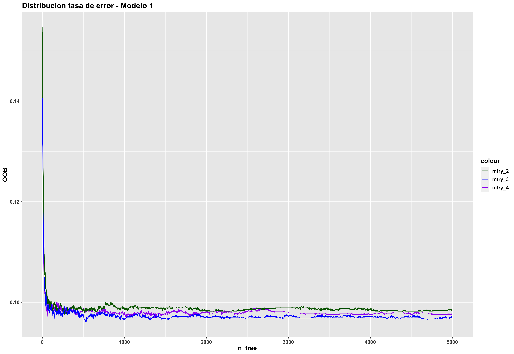
```

Al igual que en el primer modelo, a excepción de _mtry_ = 4 (correspondiente con un modelo _bagging_), para estabilizar el error __se requieren un mayor número de árboles__, en torno a 2000 aproximadamente tanto para _mtry_ = 2 como _mtry_ = 3. A continuación, echemos un primer vistazo al comportamiento de los modelos, tanto en sesgo como en varianza, utilizando los diferentes valores _mtry_, así como 2000 árboles y el mejor valor _mtry_ y _nodesize_ obtenidos en _bagging_ para el segundo _set_ de variables (20 + 1000):

```{r, out.width="99%", out.height="99%", fig.align="center", fig.cap="Tasa de fallos y AUC en funcion de mtry - Modelo 2", echo=FALSE}

```

En primera instancia, una posibilidad sería decantarse por un modelo con _mtry_ = 3, sin llegar a utilizar todas las variables. Sin embargo, y en base a la escala del eje Y, __el error y varianza que presenta el modelo con _mtry_ = 2 no es tan pronunciado__:

1. En el caso de la tasa de fallos, la diferencia es 0.005 (de 0.1025 en el caso de _mtry_ = 4 a 0.1075 en el caso de _mtry_ = 2). Además, la varianza que presenta en torno al modelo, teniendo en cuenta la escala del eje, es del orden de milésimas.

2. En el caso del área bajo la curva ROC, la diferencia también se sitúa en torno a las milésimas (de 0.906 en el caso de _mtry_ = 4 a 0.904 en el caso de _mtry_ = 2).

Dicha diferencia puede ser debida a numerosos factores: estructura de remuestreo, selección de observaciones con _sampsize_, valor de la semilla etc. Por tanto, dado que la diferencia no es apenas relevante, con el segundo _set_ de variables __nos decantamos por un valor _mtry_ = 2__.

## 8.2 Modelo 1

En un primer comienzo, con un valor _mtry_ = 3 y el mismo _nodesize_ y _sampsize_ que en el modelo _bagging_, obtenemos muy buenos resultados. No obstante, hemos considera un valor de _nodesize_ y _sampsize_ por defecto, esto es, los mejores parámetros obtenidos en _bagging_. Por tanto, ¿Puede llegar a ser influyente el hecho de aumentar o reducir el valor _nodesize_, o más importante aún, el tamaño de la submuestra en _sampsize_? Del mismo modo que en _bagging_, analicemos la importancia de ambos parámetros, tuneando el modelo con diferentes valores (comenzando con tan solo 5 repeticiones):

```{r, eval=FALSE}
sampsizes.1 <- list(1, 100, 500, 1000, 2000, 3000, 4600)
nodesizes.1 <- list(5, 10, 20, 30, 40, 50, 100)

# Tuneamos nuevamente tanto nodesizes como sampsizes
# sampsize maximo: (4/5) * 5854 ~ 4600 observaciones
bagging_modelo1_mtry3 <-  tuneo_rf(surgical_dataset, target = target,
                                   lista.continua = var_modelo1,
                                   nodesizes = nodesizes.1,
                                   sampsizes = sampsizes.1, mtry = 3,
                                   ntree = 2000, grupos = 5, repe = 5)
```

```{r, out.width="99%", out.height="99%", fig.align="center", fig.cap="Tasa de fallos y AUC en funcion de nodesize y sampsize - Modelo 1", echo=FALSE}
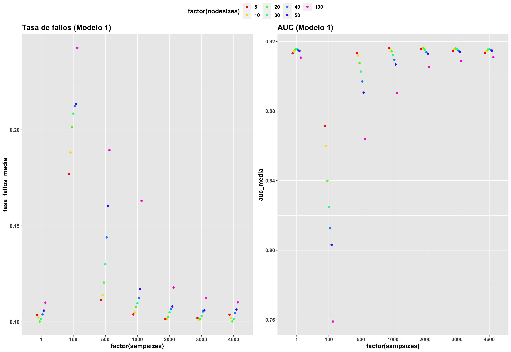
```

Analizando el promedio de cada modelo, detectamos prácitcamente las mismas características que en el modelo _bagging_:

1. __Aumentar la complejidad del árbol, con un _nodesize_ menor, la ganancia que supone tanto en tasa de fallos como en AUC no es muy relevante__, por lo que podemos mantener 20 como tamaño mínimo de cada nodo.

2. Además, a simple vista __un valor _sampsize_ en torno a 500-1000 vuelve a ser una buena opción, obteniendo los mismos resultados que con el conjunto total de las observaciones__, lo que permite la construcción de árboles mucho más diferentes entre si gracias al sorteo de menos muestras. No obstante, analicemos más en detalle tanto el sesgo como la varianza al variar el tamaño de la muestra (manteniendo el valor _nodesize_ a 20 y aumentando a el número de repeticiones a 10):

```{r, eval=FALSE}
nodesizes.1 <- list(20)
# Probamos con un tamaño sampsize entre 500 y 3000 (1 = todas las observaciones)
sampsizes.1 <- list(1, 500, 1000, 2000, 3000)

bagging_modelo1_mtry3 <-  tuneo_rf(surgical_dataset, target = target,
                                   lista.continua = var_modelo1,
                                   nodesizes = nodesizes.1,
                                   sampsizes = sampsizes.1, mtry = 3,
                                   ntree = 2000, grupos = 5, repe = 10)
```

```{r, out.width="99%", out.height="99%", fig.align="center", fig.cap="Tasa de fallos y AUC en funcion de  sampsize - Modelo 1", echo=FALSE}

```

Incluso sorteando variables, los resultados obtenido __no difieren demasiado de un modelo _bagging___: mientras que con 500 observaciones la tasa de fallos aumenta hasta 0.12 y el AUC se reduce a 0.90, a partir de un tamaño de 1000 muestras (lo que supone alrededor del 17 % del total), __no solo iguala en AUC al resto de modelos con _sampsizes_ mayores (en torno a 0.91), sino que además la ganancia de error es de tan solo unas milésimas__: entre un _sampsize_ = 1000 y 2000-3000 observaciones, la diferencia es de 0.107 - 0.102 = 0.005. Por tanto, __aumentar demasiado el tamaño de las submuestras no aporta una mejoría significativa al modelo__, por lo que nos decantamos por un valor de 1000.

Por último, para observar en mejor medida el efecto del parámetro _sampsize_, aumentamos a 10 grupos y 20 repeticiones:

```{r, out.width="99%", out.height="99%", fig.align="center", fig.cap="Tasa de fallos y AUC aumentando a 10 grupos y 20 repeticiones - Modelo 1", echo=FALSE}

```

Incluso aumentando a 10 grupos y 20 repeticiones, tanto el sesgo como la varianza se mantienen prácticamente idénticos.

## 8.2 Modelo 2

A continuación, realizamos los mismos pasos con el segundo _set_ de variables, parametrizando en primer lugar tanto _nodesize_ como _sampsize_:

```{r, eval=FALSE}
sampsizes.2 <- list(1, 100, 500, 1000, 2000, 3000, 4600)
nodesizes.2 <- list(5, 10, 20, 30, 40, 50, 100)

# Tuneamos nuevamente tanto sampsizes como nodesizes
bagging_modelo2_mtry2 <-  tuneo_rf(surgical_dataset, target = target,
                                   lista.continua = var_modelo2,
                                   nodesizes = nodesizes.2,
                                   sampsizes = sampsizes.2, mtry = 2,
                                   ntree = 2000, grupos = 5, repe = 5)
```

```{r, out.width="99%", out.height="99%", fig.align="center", fig.cap="Tasa de fallos y AUC en funcion de nodesize y sampsize - Modelo 2", echo=FALSE}

```

Del mismo modo que sucede con el primer _set_ de variables, tanto con un _nodesize_ en torno a 20 como un valor _sampsize_ entre 500 y 1000, parece una buena opción. Además, si analizamos tanto el sesgo como la varianza al variar este último parámetro, aumentando a 10 el número de repeticiones:

```{r, out.width="99%", out.height="99%", fig.align="center", fig.cap="Tasa de fallos y AUC en funcion de  sampsize - Modelo 2", echo=FALSE}

```

Tenemos el mismo comportamiento que el primer _set_ de variables: __a partir de un tamaño en torno a 1000 observaciones, la diferencia tanto en la tasa de fallos como en _AUC_ es muy pequeña__, por lo que no merece la pena aumentar aun más el tamaño de la muestra. Incluso si aumentamos el número de grupos y repeticiones a 10 y 20, respectivamente:

```{r, out.width="99%", out.height="99%", fig.align="center", fig.cap="Tasa de fallos y AUC aumentando a 10 grupos y 20 repeticiones - Modelo 2", echo=FALSE}

```

El orden de los modelos se mantiene idéntico. Por tanto, dado que el valor AUC es prácticamente el mismo, además de que la ganancia de la tasa de fallos es muy pequeña (dada la escala del eje), nos decantamos nuevamente por un modelo con _sampsize_ = 1000.

__RESUMEN _random forest___:

1. modelo 1: _mtry_ = 3, _nodesize_ = 20 y _sampsize_ = 1000.
2. modelo 2: _mtry_ = 2, _nodesize_ = 20 y _sampsize_ = 1000.

## 8.3  Modelo sin reemplazamiento

Una vez tuneados ambos _sets_ de variables, veamos la diferencia entre un modelo con _sampsize_ con reemplazamiento y sin reemplazamiento:

```{r, eval=FALSE}
#-- ¿Y si lo probamos sin reemplazamiento? Probamos con el mejor modelo en terminos de AUC (modelo 1)
bagging_modelo_sin_reemp <- tuneo_rf(surgical_dataset, target = target,
                                     lista.continua = var_modelo1, nodesizes = 20, 
                                     sampsizes = 1000, mtry = 3, ntree = 2000, 
                                     grupos = 5, repe = 10, replace = FALSE)
```

```{r, out.width="99%", out.height="99%", fig.align="center", fig.cap="Comparación Random Forest con o sin reemplazamiento", echo=FALSE}

```

Como podemos comprobar, el hecho de seleccionar muestras con o sin reemplazamiento __no aporta mejoría alguna al modelo__.

## 8.4 Comparación final

Por último, realizamos la comparación final de ambos modelos _random forest_ con los datos _test_:

```{r, echo=FALSE}
data.frame(modelo = c("Modelo 1 (BIC TOP 5)", "Modelo 2 (top 4)"),
           precision = c(0.899, 0.8964),
           sensibilidad = c(0.9052, 0.9117), especificidad = c(0.8976, 0.8931),
           valor_pred_pos = c(0.6639, 0.6465), valor_pred_neg = c(0.9769, 0.9792))
```

En base a los resultados obtenidos, no se diferencia demasiado de un modelo _bagging_:

```{r, echo=FALSE}
data.frame(modelo = c("Modelo 1 (BIC TOP 5)", "Modelo 2 (top 4)"),
           precision = c(0.901, 0.9019),
           sensibilidad = c(0.9214, 0.9468), especificidad = c(0.8966, 0.8928),
           valor_pred_pos = c(0.6589, 0.6424), valor_pred_neg = c(0.9813, 0.9880))
```

1. __Precisión__: de 0.901 y 0.9019 a 0.899 y 0.8964 en ambos _sets_ de variables, respectivamente.
2. __Sensibilidad__: de 0.9214 y 0.9468 a 0.9052 y 0.9117, respectivamente (empeora ligeramente).
3. __Especificidad__: tanto en _bagging_ como en _random forest_ se sitúa en torno a 0.89.
4. __Valor predictivo positivo__: continúa situándose en torno a 0.64-0.65-0.66.
5. __Valor predictivo negativo__: continúa situándose en torno a 0.97-0.98.

Es decir, __añadiendo el sorteo de variables al modelo (mtry), la variación que experimenta en el conjunto _test_ es muy pequeña__. De hecho, si observamos la distribución de la tasa de fallos y AUC:

```{r, out.width="99%", out.height="99%", fig.align="center", fig.cap="Comparacion tasa fallos log-avnnet-bagging-rf", echo=FALSE}
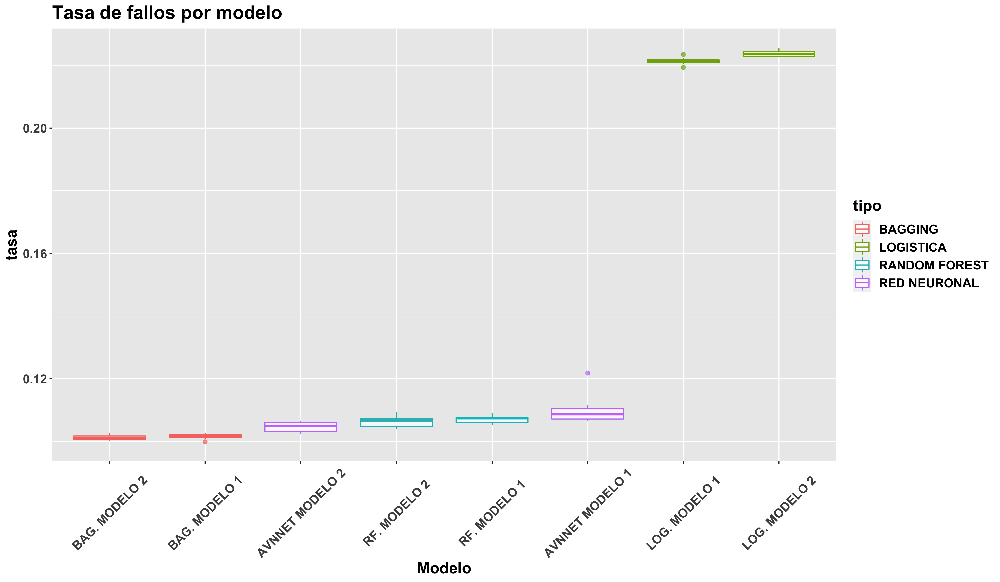
```
```{r, out.width="99%", out.height="99%", fig.align="center", fig.cap="Comparacion AUC log-avnnet-bagging-rf", echo=FALSE}
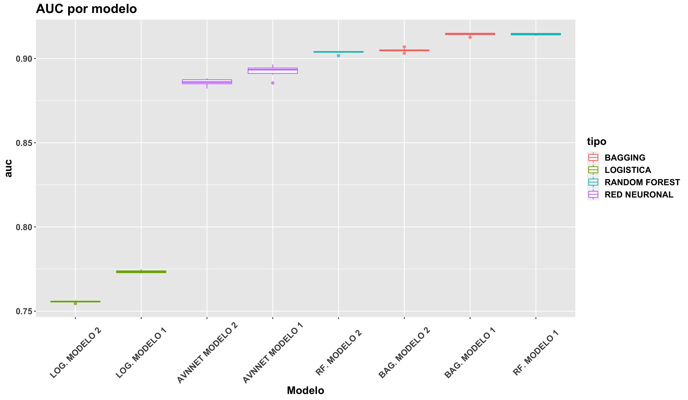
```

En relación al resto de modelos, _random forest_ se situa a la misma altura que modelos como _bagging_ o _avnnet_. De hecho, si hacemos "zoom" sobre los modelos de árbol:

```{r, out.width="99%", out.height="99%", fig.align="center", fig.cap="Comparacion modelos bagging y rf", echo=FALSE}

```

Comprobamos que la diferencia entre ambos no es muy significativa, como es el caso de la tasa de fallos, donde la escala del eje puede llevar a engaño, ya que la diferencia entre ambos modelos es de apenas unas milésimas (de 0.1000 - 0.1025 en el caso de _bagging_ a 0.1050-0.1075 en _random forest_). Además, aunque la varianza en este último parezca aumentar, dada la escala del eje no es tan pronunciada.

De nuevo, no existe demasiada diferencia entre ambos _sets_ de variables, tanto en tasa de fallos como en AUC, pese a la diferencia de una variable _input_.

# 9. _Gradient Boosting_

Hasta el momento, hemos comprobado como la variación en el _accuracy_, tasa de error o AUC con los ambos _sets_ candidatos no resulta ser relevante, incluso en numerosas ocasiones los parámetros finales acaban siendo los mismos para ambos candidatos. Por tanto, de cara al resto de modelos como _grandient boosting_, _xgboost_ o _svm_, veamos si es posible poner en común un mismo tuneo de hipérparametros para ambos _sets_, en lugar de "tunear" por separado cada uno de ellos.

## 9.1 Tuneo de hipérparámetros

En primer lugar, comenzando con el tuneo de los diferentes hiperparámetrosm en ambos modelos, con tan solo cinco repeticiones:

1. _shrinkage_: parámetro de regularización.
2. _n.minobsinnode_: tamaño máximo de nodos finales (parámetro encargado de medir la complejidad).
3. _n.trees_: número de iteraciones (árboles).
4. _bag.fraction_: fracción de observaciones del conjunto de entrenamiento seleccionadas aleatoriamente para la construcción del siguiente árbol.

```{r, eval=FALSE}
#-- Ejemplo de tuneo con el primer set de variables
set.seed(1234)
#-- El valor maximo de shrinkage suele estar en torno a 0.2 (probamos con 0.3 y 0.4 tambien)
gbmgrid<-expand.grid(shrinkage=c(0.4,0.3,0.2,0.1,0.05,0.03,0.01,0.001),
                     n.minobsinnode=c(5,10,20),
                     n.trees=c(100,500,1000,5000),
                     interaction.depth=c(2))

#-- De momento, mantenemos bag.fraction a 1 (todas las observaciones)
control<-trainControl(method="repeatedcv",number=5,savePredictions = "all", 
                      repeats=5,classProbs=TRUE)
gbm_modelo1 <- train(formula_modelo_1,data=surgical_dataset,
                     method="gbm",trControl=control,tuneGrid=gbmgrid,
                     distribution="bernoulli", bag.fraction=1,verbose=FALSE)
```

```{r, out.width="99%", out.height="99%", fig.align="center", fig.cap="Comparacion hiperparámetros gbm modelo 1", echo=FALSE}

```
```{r, out.width="99%", out.height="99%", fig.align="center", fig.cap="Comparación hiperparámetros gbm modelo 2", echo=FALSE}

```

¿Qué sucede en ambos _sets_ de variables? En primer lugar, analicemos las recomendaciones de _caret_ para ambos _sets_:

```
Modelo 1: n.trees = 500,  shrinkage = 0.1,  n.minobsinnode = 20. Accuracy: 0.9055354
Modelo 2: n.trees = 5000, shrinkage = 0.01, n.minobsinnode = 20. Accuracy: 0.9039292
```

En función de lo recomendado por el propio paquete, existe un contraste entre ambos modelos: por un lado, con cinco variables _input_ recomienda 500 iteraciones, un valor de regularización alto y _n.minobsinnode_ alto (20), es decir, modelos más simples. Por el contrario, con una variable _input_ menos, recomienda muchos más árboles (5000) y un valor de regularización más bajo.

Desde un punto de vista numérico, con estos parámetros se han obtenido el _accuracy_ máximo (incluso también por la estructura de remuestreo, valor de la semilla, etc.). Sin embargo, ¿Es una configuración óptima? O aún más importante ¿Podrían obtenerse resultados similares con modelos más sencillos? Para responder a ambas preguntas, __debemos analizar los posibles patrones que presenta el modelo en ambos _sets___, de forma que podamos decantarnos por una opción mucho más sencilla.

Concretamente, destacamos tres grandes patrones de comportamiento:

1. Por un lado, __un bajo número de iteraciones (en torno a 100), junto con un valor de regularización alto ( _shrinkage_ superior o igual a 0.2-0.3, aproximadamente)__.

2. Por el contrario, también es posible obtener un máximo _accuracy_ __con un valor _shrinkage_ bajo (inferior a 0.1), pero con un elevado número de iteraciones, en torno a 500, 1000 o 5000__.

3. Además, el comportamiento de _n.minobsinnode_ en ambos _sets_ es el mismo tanto para un valor de 5, como de 10 o 20, __por lo que un valor alto (20) es una buena opción a decantarse: a un mayor valor _n.minosinnode_, obtenemos modelos más simples y con menos posibilidad de sobreajuste__.

En conclusión, __no es necesario tunear exageradamente el modelo en ambos casos__, sino que aparentemente con un número de árboles bajo (100), un valor de regularización alto (en torno a 0.2-0.3) y _n.minobsinnode_ = 20 se obtienen de por sí buenos resultados, sin necesidad de complicar aún más el modelo.

### 9.1.1 Estudio del _Early Stopping_

Continuando con la línea anterior, para ambos _set_ de variables __probamos a fijar _n.minobsinnode_ = 20 y _shrinkage_ = 0.2 y 0.3__, observando no solo qué número de iteraciones/árboles sería adecuado utilizar, sino además si con un valor de regularización de 0.2 es suficiente o si aumentando su valor obtenemos mejores resultados, ya que en el gráfico anterior se detectó un ligero ascenso en el valor de _accuracy_ en 0.3 (normalmente el valor máximo suele ser 0.2):

```{r, out.width="99%", out.height="99%", fig.align="center", fig.cap="Estudio Early Stopping Modelos 1 y 2", echo=FALSE}

```

En ambos _sets_, __observamos que con 100 árboles se obtiene un buen _accuracy___, mientras que a partir de 400-500 iteraciones, el modelo comienza a sobreajustarse y, como consecuencia, disminuye su precisión. Por otro lado, en relación con el parámetro _shrinkage_ no existe apenas diferencia entre un valor 0.2 y 0.3, por lo que __nos decantamos por 0.2__.

### 9.1.2 Estudio de _bag.fraction_

Hasta el momento, hemos tuneado los modelos _gbm_ __con el conjunto total de las observaciones, esto es, con _bag.fraction_ = 1__. Sin embargo, _caret_ por defecto __no sortea todas las observaciones, sino que por defecto escoge el 50 % aleatoriamente (0.5)__ [^6]

[^6]: _caret_ emplea internamente el paquete _gbm_, cuyo valor _bag.fraction_ por defecto es 0.5. https://cran.r-project.org/web/packages/gbm/gbm.pdf

Como consecuencia, sobre ambos _sets_ __estudiamos la variabilidad del modelo con respecto a dicho parámetro__, aumentando a 10 el número de repeticiones para observar mejor su efecto. Dado que la función _cruzadagbmbin_ nos dispone de dicho parámetro, se ha incluido internamente en la función _train_ de _caret_:

```{r, eval=FALSE}
#-- bag.fraction no se permite tunear desde expand.grid...
gbmgrid <- expand.grid(n.minobsinnode=n.minobsinnode, shrinkage=shrinkage,
                      n.trees=n.trees, interaction.depth=interaction.depth)
#-- Por lo que lo incluimos dentro de train  
gbm    <- train(formu,data=databis, method="gbm",trControl=control,
                bag.fraction=bag.fraction, tuneGrid=gbmgrid,distribution="bernoulli",
                verbose=FALSE)
```

```{r, out.width="99%", out.height="99%", fig.align="center", fig.cap="Estudio bag.fraction modelos 1 y 2", echo=FALSE}

```

En un primer análisis, la diferencia entre _bag.fraction_ = 0.5 y _bag.fraction_ = 1 es pequeña, ya que tanto en sesgo como en varianza presentan resultados similares, salvo en la tasa de fallos donde aumenta ligeramente, pero no demasiado dada la escala de los ejes (por ejemplo, en el modelo 1 la varianza se sitúa entre 0.099 y 0.104, considerando los _outliers_). Por tanto, __no existe apenas diferencia entre utilizar el 100 % de las observaciones y tan solo el 50 %__, por lo que podemos mantener dicho parámetro por defecto en _bag.fraction_.

__RESUMEN _gradient boosting___:

1. modelos 1 y 2: _n.trees_ = 100, _shrinkage_ = 0.2, _n.minobsinnode_ = 20 y _bag.fraction_ = 0.5.

## 9.2 Comparación final

A continuación, con los modelos obtenidos realizamos la predicción sobre el conjunto _test_:

```{r, echo=FALSE}
data.frame(modelo = c("Modelo 1 (BIC TOP 5)", "Modelo 2 (top 4)"),
           precision = c(0.903, 0.9052),
           sensibilidad = c(0.9149, 0.9264), especificidad = c(0.9003, 0.9006),
           valor_pred_pos = c(0.6731, 0.6731), valor_pred_neg = c(0.9792, 0.9823))
```

Como podemos comprobar, _gradient boosting_ se sitúa prácticamente en la misma línea que el resto de modelos basados en árbol: __alta precisión, sensibilidad, especificidad y valor predictivo negativo, pero con un valor predictivo positivo menor, en torno al 67 %__:

```{r, out.width="99%", out.height="99%", fig.align="center", fig.cap="Comparacion tasa fallos log-avnnet-bagging-rf-gbm", echo=FALSE}
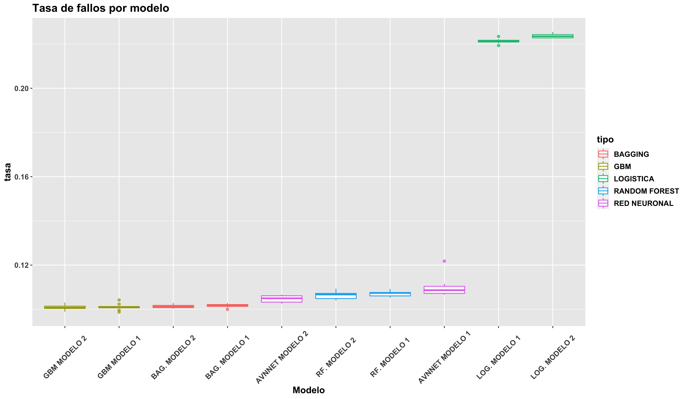
```
```{r, out.width="99%", out.height="99%", fig.align="center", fig.cap="Comparacion AUC log-avnnet-bagging-rf-gbm", echo=FALSE}
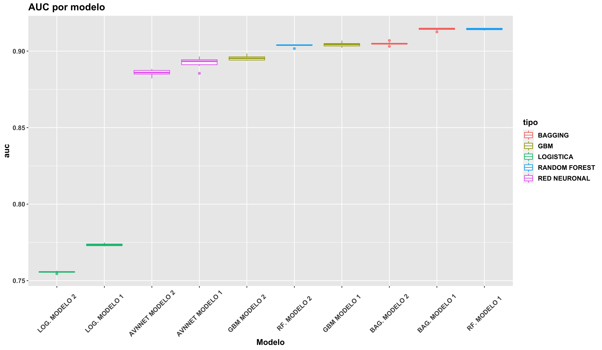
```

De hecho, aunque la tasa de fallos en _gradient boosting_ sea ligeramente menor, __modelos como _random forest_ o _bagging_ continuan siendo una mejor alternativa__.

# 10. _Support Vector Machines_

## 10.1 SVM Lineal

A continuación, continuamos con los modelos _svm_, comenzando por el _kernel_ más sencillo: el lineal, del cual solo necesitamos tunear el parámetro de regularización __C__ (por el momento, empleamos 5 repeticiones):

```{r, eval=FALSE}
#-- Probamos desde C = 0.01 hasta C = 10
C_binaria <- expand.grid(C=c(0.01,0.05,0.1,0.2,0.5,1,2,5,10))

#-- Ejemplo con el primer set de variables (5 variables input)
cruzadaSVMbin(data=surgical_dataset, vardep=target,
                           listconti = var_modelo1, listclass=c(""),
                           grupos=5,sinicio=1234,repe=5,C=C_binaria)
```

```{r, out.width="99%", out.height="99%", fig.align="center", fig.cap="Distribución SVM Lineal Modelos 1 y 2", echo=FALSE}
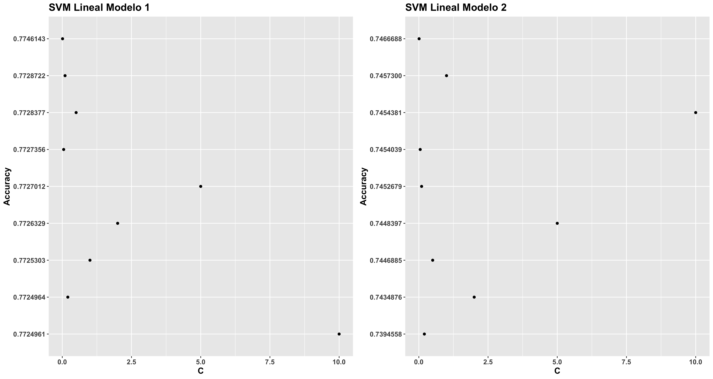
```

```
Recomendado por caret
Modelo 1: C = 0.01. Accuracy: 0.7746143
Modelo 2: C = 0.01. Accuracy: 0.7466688
```

A diferencia del resto de modelos no lineales, con el primer _set_ de variables (5 variables _input_ incluyendo _ccsMort30Rate_), obtenemos un _accuracy_ en torno al 77 %, mientras que con tan solo 4 variables desciende al 74 %, de nuevo un indicativo de la relación lineal de dicha variable con la variable objetivo. Pese a ello, __los modelos basados en árbol o _boosting_ continuan siendo mejor en términos de _accuracy_ (89-90 %)__.

En relación con la constante C, dada la escala de los ejes __no se aprecia una diferencia relevante entre los diferentes valores__, ya que apenas varían en unas milésimas. Sin embargo, si se tuviera que indica un posible patrón, diríamos que a medida que se reduce la constance C, aumenta ligeramente el _accuracy_. Podríamos incluso probar a reducir aún más el parámetro de regularización:

```{r}
#-- Probamos a reducir C entre 0.1 y 0.001
C_binaria <- expand.grid(C=c(0.001,0.005,0.01))
```

Pero tan solo aumenta en 0.0001 en ambos _sets_:

```
Modelo 1: C: 0.01 -> 0.7746143 ; C: 0.001 -> 0.7749898
Modelo 2: C: 0.01 -> 0.7466688 ; C: 0.001 -> 0.7749898
```

Por tanto, y dado que la diferencia no es muy significativa, __nos decantamos por el máximo _accuracy_, correspondiente con C = 0.01__, recomendado por _caret_, un valor no demasiado alto, lo que se traduce en un menor riesgo por sobreajuste (márgenes de separación mucho mayores).

## 10.2 SVM Polinomial

A continuación, proseguimos con el _kernel_ polinomial, __tuneando tanto la constante C de regularización como la escala__ (nuevamente, con cinco repeticiones): 

__NOTA: dado que los polinomios de grado 3 tardaban demasiado tiempo en procesar (incluso con una sola repetición + _doParallel_), se ha utilizado únicamente grado 2__.

```{r, eval=FALSE}
#-- Probamos con C desde 0.01 hasta 10
C_poly      <- c(0.01, 0.05, 0.1, 0.2, 0.5, 1, 2, 5, 10)
degree_poly <- c(2)
#-- Probamos desde una escala pequeña (0.1) hasta 5
scale_poly  <- c(0.1, 0.5, 1, 2, 5)

#-- Ejemplo con el primer set de variables (5 variables input)
svm_pol_1 <- cruzadaSVMbinPoly(data=surgical_dataset, vardep=target,
                               listconti = var_modelo1, listclass=c(""),
                               grupos=5,sinicio=1234,repe=5,C = C_poly,
                               degree = degree_poly, scale = scale_poly)
```

```{r, out.width="99%", out.height="99%", fig.align="center", fig.cap="Distribución SVM Polinomial Modelos 1 y 2 (I)", echo=FALSE}

```

```
Recomendado por caret
Modelo 1: C = 5   ; degree = 2; scale = 0.1. Accuracy: 0.7766301
Modelo 2: C = 0.01; degree = 2; scale = 0.1. Accuracy: 0.7766992
```

En base a la respuesta del paquete _caret_, con el primer _set_ recomienda una escala en torno a 0.1 y una constance C alta (5), mientras que en el caso del segundo _set_ de variables, la constante C recomendada es más baja, en torno a 0.01. No obstante, y dado que __no podemos dejarnos llevar por valores puntuales (pues puede conducir al sobreajuste), analicemos los patrones existentes__:

1. En el caso del primer _set_ de variables, nos encontramos con dos posibles extremos: __o bien una constante C alta (entre 5 y 10) y una escala moderada/pequeña (en torno a 0.1-0.5-1) o una constante C pequeña y una escala mayor (1, 2 o 5)__.

2. En el segundo _set_, por otro lado, __llama la atención modelos con una constante C pequeña (menor a 0.01) y una escala baja (0.1-0.5, principalmente)__.

Por tanto, analicemos si mejoran los resultados en caso de, en el primer _set_, aumentar la constante C a 15 y 20, así como disminuirlo a 0.005 y 0.001. Por otro lado, probamos también a reducir C a 0.005 y 0.001 en el segundo _set_ de variables:

```{r, out.width="99%", out.height="99%", fig.align="center", fig.cap="Distribución SVM Polinomial Modelos 1 y 2 (II)", echo=FALSE}

```

1. En el caso del primer _set_, pese a reducir o aumentar la constante C, el valor de _accuracy_ se mantiene en torno a 0.77. Por tanto, y dado que la diferencia no es muy significativa entre un valor C alto y pequeño, __podemos decantarnos por un valor en torno a 0.5 (moderado-bajo), así como una escala de 1__, aunque _caret_ nos recomiende un valor C = 5, de forma que los márgenes de separación entre ambas clases es mayor, obteniendo un modelo más "general".

De nuevo, __la decision esta basada por patrones y no en valores puntuales__, por lo que empleando otra semilla y con otros valores training los parametros serán "aproximadamente" similares, aunque no iguales. Por tanto, dado que la diferencia entre un modelo SVM más ajustado (C = 5) y un modelo más general (C = 0.5) es ínfima.

2. Por otro lado, en relación con el segundo _set_, habiendo disminuido el valor C hasta 0.001-0.005, no ha hecho aumentar en gran medida el resultado. Por tanto, dado que con un valor C pequeño no solo obtenemos un mayor margen de separación (maniobrabilidad), sino además el mismo _accuracy_ que el de un modelo más "estricto" en la separación, __nos decantamos por la opción de _caret___: C pequeño (0.01) y escala pequeña (0.1).

## 10.3 SVM RBF

Finalizando con el _kernel_ radial, comenzando tuneando los dos parámetros principales: C y $\sigma$:

```{r, eval=FALSE}
#-- Probamos con C entre 0.01 y 10
C_rbf      <- c(0.01,0.05,0.1,0.2,0.5,1,2,5,10)
sigma_rbf  <- c(0.1, 0.5, 1, 2, 5, 10)

#-- Ejemplo con el primer set variables
svm_rbf_1 <- cruzadaSVMbinRBF(data=surgical_dataset, vardep=target,
                              listconti = var_modelo1, listclass=c(""),
                              grupos=5,sinicio=1234,repe=5,C = C_rbf,
                              sigma = sigma_rbf, label = "Modelo 1")
```

```{r, out.width="99%", out.height="99%", fig.align="center", fig.cap="Distribución SVM RBF Modelos 1 y 2 (I)", echo=FALSE}

```

```
Recomendado por caret
Modelo 1: C = 1   ; sigma = 5 ; Accuracy: 0.8422943
Modelo 2: C = 1   ; sigma = 5 ; Accuracy: 0.8726666
```

En base a los resultados devueltos por _caret_, para ambos _sets_ de variables recomienda una constante C pequeña/moderada (1), así como un valor $\sigma = 5$. No obstante, y dado que se tratan de valores puntuales, analicemos los patrones existentes:

1. En el caso del primer _set_, __los modelos con mayor _accuracy_ presentan un valor sigma alto (en torno a 5-10 aumenta hasta 0.83)__. En relación al valor C, prácticamente con cualquier valor el _accuracy_ se sitúa en torno a 0.86-0.87, alcanzando su punto máximo en C = 1. Es decir, __no es necesario un valor C alto (márgenes de separación más pequeños), ya que a partir de C = 2, 5, el _accuracy_ comienza a disminuir__. Por otro lado, otro posible patrón de comportamiento sería con un valor _sigma_ menor (2) y C alto (a partir de 5-10), donde comienza a aumentar el _accuracy_.

2. En el caso del segundo modelo, el comportamiento es bastante similar: __o bien escogemos valores _sigma_ altos (5-10) y C no demasiado alto (menor a 1), o bien un valor _sigma_ menor (2) y una constante C alta (en torno a 5, 10)__.

En ambos _sets_, podemos comprobar cómo evoluciona el modelo si aumentamos el valor de C con _sigma_ = 2, dado que a simple vista comienza a aumentar conforme incrementamos C (de 0.775 a 0.875):

```{r, out.width="99%", out.height="99%", fig.align="center", fig.cap="Distribución SVM RBF Modelos 1 y 2 (II)", echo=FALSE}

```

Incluso aumentando _C_, se obtienen prácticamente los mismos resultados que con un _sigma_ y C menor.

En conclusión, para ambos _sets_ de variables __nos decantamos por un valor _sigma_ alto (escogemos 5), y una constante C no demasiado alta, entre 0.5 y 1__:

```
Recomendado por caret
Modelo 1: C = 1   ; sigma = 5 ; Accuracy: 0.8422943
          C = 0.5 ; sigma = 5 ; Accuracy: 0.8415420

Modelo 2: C = 1   ; sigma = 5 ; Accuracy: 0.8726666
          C = 0.5 ; sigma = 5 ; Accuracy: 0.8711983
```

Dado que la diferencia entre _C_ = 1 y _C_ = 0.5 no es muy relevante (aunque _caret_ recomiende 1), resulta indiferente escoger uno de ellos (por ejemplo, escogemos 0.5).

## 10.4 Comparación modelos SVM

Una vez elaborados los modelos, __empleando validación cruzada repetida de 5 grupos y 10 repeticiones, analizamos tanto la tasa de fallos como el AUC (en ambos _sets_ de variables)__:

```{r, out.width="99%", out.height="99%", fig.align="center", fig.cap="Comparación tasa de fallos y AUC modelos SVM", echo=FALSE}

```

Sin duda alguna, __la mejor alternativa tanto en tasa de fallos como en AUC es el modelo SVM con _kernel_ radial (RBF)__. De hecho, quisiera remarcar dos detalles fundamentales, relacionados con los _sets_ de variables:

1. Por un lado, en relación con el _kernel_ lineal, __observamos una considerable diferencia entre el primer _set_ con cinco variables (junto con _ccsMort30Rate_) y el segundo _set_, tanto en AUC, sesgo y varianza__: incluyendo dicha variable (relación lineal), el modelo mejora hasta 0.74-0.75 de AUC, aproximadamente, además de reducir la tasa de error hasta 0.22 (a diferencia del primer _set_, que alcanza 0.26).

2. Por el contrario, con el _kernel_ radial, añadir dicha variable perjudica al modelo en cuanto a la tasa de fallos (de 0.16 con cinco variables a 0.12-0.13 con tan solo cuatro), aunque en AUC se mantienen prácticamente idénticos.

Por otro lado, __analicemos las predicciones obtenidas con el conjunto _test___:

__SVM Lineal__:

```{r, echo=FALSE}
data.frame(modelo = c("Modelo 1 (BIC TOP 5)", "Modelo 2 (top 4)"),
           precision = c(0.789, 0.549),
           sensibilidad = c(0.65844, 0.4998), especificidad = c(0.80678, 0.7655),
           valor_pred_pos = c(0.31733, 0.1731), valor_pred_neg = c(0.94540, 0.7823))
```

__SVM Polinomial__:

```{r, echo=FALSE}
data.frame(modelo = c("Modelo 1 (BIC TOP 5)", "Modelo 2 (top 4)"),
           precision = c(0.794, 0.7826),
           sensibilidad = c(0.71977, 0.63188), especificidad = c(0.80205, 0.80316),
           valor_pred_pos = c(0.28304, 0.30453), valor_pred_neg = c(0.96345, 0.94116))
```

__SVM RBF__:

```{r, echo=FALSE}
data.frame(modelo = c("Modelo 1 (BIC TOP 5)", "Modelo 2 (top 4)"),
           precision = c(0.8517, 0.8804),
           sensibilidad = c(0.8000, 0.8897), especificidad = c(0.8622, 0.8786),
           valor_pred_pos = c(0.5396, 0.5935), valor_pred_neg = c(0.9553, 0.9756))
```

Al igual que en la comparación, con el conjunto _test_ __los modelos SVM RBF resultan ser claramente los ganadores__, aunque con unos porcentajes inferiores con respecto a los modelos basados en árbol o _gradient boosting_:

```{r, out.width="99%", out.height="99%", fig.align="center", fig.cap="Comparacion tasa fallos log-avnnet-bagging-rf-gbm-svm", echo=FALSE}

```
```{r, out.width="99%", out.height="99%", fig.align="center", fig.cap="Comparacion AUC log-avnnet-bagging-rf-gbm-svm", echo=FALSE}
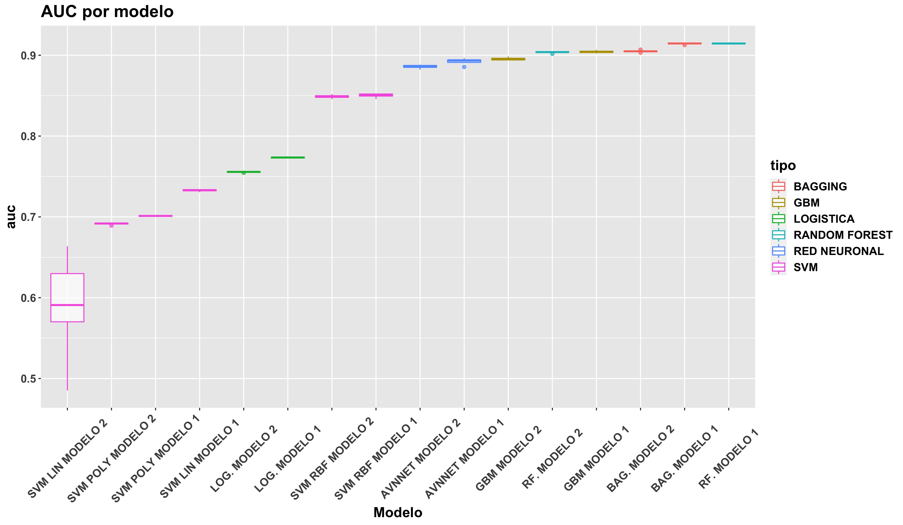
```

Antes de continuar con _XGboost_ y Ensamblado, debemos detenernos a analizar si realmente es necesario continuar con ambos _sets_ de variables o no. A lo largo de la práctica (logística, redes, modelos basados en árbol, _boosting_, svm) se ha podido comprobar que la diferencia entre ambos candidatos, por tan solo una variable _input_, no ha sido especialmente relevante, pese a lo observado en la regresión logística donde si existía cierta diferencia entre ambos.

Por tanto, de cara a _XGboost_ pero especialmente a los modelos de Ensamblado __continuaremos con únicamente con el segundo _set_ de variables _input_ (4 variables), a excepción del modelo _svm_ lineal, donde utilizaremos el modelo obtenido con el primer _set___.

# 11. XGboost

## 11.1 Tuneo de hiperparámetros

En primer lugar, debemos recordar los parámetros a tunear en un modelo _XGboost_:

1. _min_child_weight_: número de observaciones mínimas en el nodo final. Similar a _n.minobsinnnode_ de _gbm_.

2. _eta_: parámetro de regularización.

3. _rounds_: número de iteraciones.

4. _max_depth_: profundidad máxima de los árboles.

5. _gamma_: constante de regularización (lo mantenemos a 0).

6. _colsample_bytree_: porcentaje de sorteo de variables en cada árbol (lo mantenemos a 1).

7. _subsample_: sorteo de observaciones antes de cada árbol (lo mantenemos a 1).

```{r, eval=FALSE}
xgbmgrid <- expand.grid(min_child_weight=c(5,10,20),
                        eta=c(0.1,0.05,0.03,0.01,0.001), 
                        nrounds=c(100,500,1000,5000),
                        max_depth=6,gamma=0,
                        colsample_bytree=1,subsample=1)

#-- Probamos al comienzo con 5 repeticiones
set.seed(1234)
control<-trainControl(method = "repeatedcv",number=5,repeats = 5,
                      savePredictions = "all",classProbs=TRUE)

xgbm_ <- train(formula_modelo2,data=surgical_dataset,
               method="xgbTree",trControl=control,
               tuneGrid=xgbmgrid,verbose=FALSE)
```

```{r, out.width="99%", out.height="99%", fig.align="center", fig.cap="Tuneo hiperparámetros XGboost", echo=FALSE}

```

De los gráficos anteriores, __se deduce que se debe tomar un valor _eta_ alto (en torno a 0.1) y pocas iteraciones, alrededor de 100__. Además, si nos fijamos en la escala de los ejes, __no existe demasiada diference entre un valor _min_child_weight_ bajo (5) y alto (20)__, tan solo de apenas unas décimas (0.90 y 0.89, respectivamente). Por tanto, escogemos un valor de 20 al ser las diferencias tan pequeñas, permitiendo con ello modelos más simples y con menos sobreajuste.

## 11.2 Estudio _Early Stopping_

A continuación, probamos a fijar algunos parámetros para analizar cómo evoluciona el modelo en función del número de iteraciones:

```{r, out.width="99%", out.height="99%", fig.align="center", fig.cap="Evolucion Early Stopping XGboost", echo=FALSE}

```


